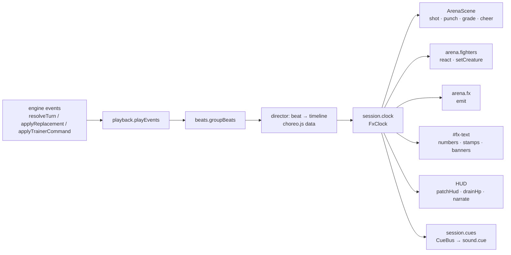

# Battle presentation contract ("Stade Lumière", Phase 3)

This is the binding interface between the six Phase 3 units of the upgrade plan
([`superpowers/plans/2026-09-29-state-of-the-art-upgrade.md`](superpowers/plans/2026-09-29-state-of-the-art-upgrade.md) §3):

| Unit | Scope |
| --- | --- |
| **3A** | Stage: `ArenaScene` v2 in `src/presentation/arena.js` (+ optional `src/presentation/stage/*.js`) |
| **3B** | WebGL fighters: `FighterLayer` in `src/presentation/fighters.js`, DOM proxies |
| **3C-1** | Director (`src/battle-ui/director.js`), GPU `FxLayer` (`src/presentation/fx-layer.js`), `#fx-text` numbers/stamps, `playback.js` rewrite |
| **3C-2** | Choreography data (`src/data/choreo.js`), FX atlas, banners (`src/battle-ui/banners.js`), presentation-contract test |
| **3D** | Battle HUD, dock, sheets, narration box, stage geometry |
| **3E** | Sound cue API in `src/sound.js` |

Three real modules ship with this contract and are the only shared runtime code the units build on:
[`src/battle-ui/fx-clock.js`](../src/battle-ui/fx-clock.js), [`src/battle-ui/beats.js`](../src/battle-ui/beats.js),
[`src/battle-ui/cues.js`](../src/battle-ui/cues.js) (tests: `test/fx-clock.test.js`, `test/beats.test.js`).

Rules that apply everywhere below:

- Engine determinism is untouched. Presentation reads events and `state`; it never calls the engine RNG and never
  `Math.random()`. All FX randomness comes from `fxSeed(...)` / `fxRandom(seed)` (§3.5).
- "×1 ms" means **virtual milliseconds on the session fx-clock at ×1**. Real milliseconds are written "real ms".
- A "side" is `'player' | 'enemy'`. A "view" is the presented battle state (`session.displayState ?? session.state`).
- No runtime stub, placeholder, no-op API or fake fallback ships at Gate 3 (§16).

---

## 1. Pipeline and lifecycle



Per battle session (`ctx.battleSession`):

1. `startBattle` creates the session (controller, unchanged shape: `sessionToken`, `cancelled`, `timeline`, `displayState`).
2. `renderBattle` builds the DOM (§11.1), creates `ArenaScene` (§7), awaits `route.patchFighters(session.state)` (§8.4), calls
   `arena.warmUp()`, then `battleEntrance(session)`, which awaits `route.playIntro(session)` (§6.6).
3. The first of `playIntro` / `playEvents` creates the presentation pair with `ensurePresentation(session)` (director.js):
   - `session.clock = new FxClock({ speed: ctx.save.battleSpeed, instant: ctx.testAnimationScale === 0, alive })`,
     where `alive = () => ctx.battleSession === session && !session.cancelled && screen.classList.contains('battle-screen')`
     (a non-battle session, the Move Theater's, brings its own `session.alive()` instead; §8.5);
   - `session.cues = new CueBus()`, with `session.cues.on('*', (payload, name) => ctx.sound.cue(name, payload))`;
   - `ctx.arenaScene?.setClock(session.clock)`.
4. Each player action: controller locks input, `beginPresentation(session, preTurnState)`, `await playEvents(result.events)`,
   then (enemy replacement) `await playEvents(replacement.events)`, then unlocks. Unchanged controller flow.
5. End: `finishBattle` (results.js, unchanged) awaits `route.battleOutroFx(state)` (§6.7).
6. Leaving the battle: any cancellation path makes `alive()` false; the clock disposes itself on its next use or tick
   (pending waits resolve `false`), and `disposeArena()` disposes the scene (fighters and FX included). The director also
   calls `session.cues.dispose()` when `playEvents`/`battleOutroFx` observe a dead session. Nothing is global.

`ctx.currentFxMove` keeps its meaning for the quality governor (`src/app/quality.js`, `atBoundary`): the director sets it
to the playing beat object at beat start and to `null` at beat end, so tier demotions only apply between beats.

---

## 2. Engine event catalogue (after Phase 2F)

Source of truth: `src/battle/engine.js`. Every event also carries `turn` (stamped by the engine). There is **no**
`arena-pulse` event: arena weather is continuous (`state.weather` = `{ [moveAffinity]: multiplier }`, `{}` for Crystal)
and appears only as `damage.weather`.

| Type | Payload fields | Emitted by / notes |
| --- | --- | --- |
| `move-start` | `side, creatureId, moveId, allyIndex?` | Opens every executed move. `allyIndex` only for `allySwitch` moves (Relève immaculée). |
| `move-skip` | `side, reason: 'ko'` | The actor was K.O.'d earlier this turn. Always directly follows the `ko` events that caused it. |
| `damage` | `side` (target), `sourceSide, sourceCreatureId, creatureId` (target), `amount` (HP lost, ≥ 0), `rawAmount, absorbed, hit, hits, hp, maxHp, affinity` (0.5 / 1 / 2), `moveAffinity, combo` (`{ multiplier: 1.3, helperId: id \| null }` on hit 1 only, else `null`), `critical: boolean` (same value on every hit of the action), `weather` (applied arena multiplier, 1 when neutral) | One per landed hit. `hits` is the move's declared count: a lethal hit ends the loop early, so fewer `damage` events than `hits` can exist. `amount === 0 && absorbed > 0` is a fully blocked hit. |
| `barrier-hit` | `side, creatureId, amount` (absorbed this hit), `total` (barrier left) | Immediately before its `damage` (a `nine_lives` `passive` may sit in between). |
| `barrier` | `side, creatureId, amount` (gain actually applied), `total, source?: 'passive'` | Move/talent/Ace/team barriers. |
| `barrier-break` | `side, creatureId, amount, total, source: 'passive' \| 'purge'` | `heartwood_wedge` and purge moves. |
| `heal` | `side, creatureId, amount, hp, maxHp, source: 'move' \| 'team' \| 'drain' \| 'passive' \| 'ace'` | Only when `amount > 0`. Team heals emit one per healed ally (bench included). |
| `status` | `side, creatureId, status, applied: boolean`; applied: `remaining` (number \| null), `stacks, sourceCreatureId` (\| null); `ill_omen` entry adds `source: 'passive'`; consumption adds `consumed: true` (`focused`; Marqué uses `source: 'combo'`; moves' `consume` list) | Removal (`applied: false`) without `consumed` = cleanse, purge, or the engine using up Esquive (after `miss`) / Riposte (after its `recoil`). |
| `miss` | `side` (dodger), `sourceSide, creatureId` (dodger), `moveId` | Esquive consumed; followed by the `evasive` removal. |
| `recoil` | `side` (attacker), `creatureId, amount, hp, maxHp, source: 'countering' \| 'bramblehide' \| 'recoil'` | |
| `status-tick` | `side, creatureId, status: 'burning', amount, hp, maxHp, remaining` | End of turn, active creatures only. |
| `surge` | `side, amount` (signed change), `total, source` (`'signature' \| 'damage' \| 'support' \| 'heal' \| 'switch' \| 'resolve' \| 'passive' \| 'command' \| 'perfect-relay' \| 'ace'`), `ready: boolean` (`total === 100`) | Only when the gauge changes. The Signature spend is negative and follows its `move-start`. |
| `assist` | `side` (attacker side), `creatureId` (helper), `attackerId, combo: true` | Combo finished on a Marqué set by an ally. |
| `passive` | `side, creatureId, passive`; entry talents add `status, remaining, stacks`, `ill_omen` adds `targetSide, targetCreatureId` | Talent trigger; its effect follows as its own event. |
| `trainer-command` | `side, creatureId, command: 'coach'` | Only from `applyTrainerCommand`, followed by removals and `surge`. |
| `perfect-relay` | `side` (switched defender), `sourceSide, creatureId, moveId` | After the switches, before any move. |
| `switch` | `side, from, to, activeIndex, creatureId` (incoming), `source: 'switch' \| 'signature'` | Voluntary switch (turn start) or queued relay (after both actions). |
| `replace` | same as `switch`, `source: 'replacement'` | Only from `applyReplacement`. |
| `ko` | `side, creatureId, hp` | Attacker K.O. can be recorded mid-action (reflected damage); target K.O. at the end of the action; burn K.O. in the tick. |
| `ace` | `side: 'enemy', creatureId, ace, hp?, maxHp?` (`titanheart`) | After an enemy `replace` when one creature is left; its effects follow. |
| `battle-end` | `winner, reason: 'knockout' \| 'turn-cap'` (no `side`) | Always the last event. |

Action shapes, legality and the damage formula are in [`battle-system.md`](battle-system.md).

---

## 3. Beats (`src/battle-ui/beats.js`)

`groupBeats(events)` is pure (no DOM, no ctx, no randomness) and returns ordered beats. **Every input event lands in exactly
one beat**, and each beat's `events` keep engine order. The director plays beats in array order.

### 3.1 Grouping rules

| Event | Rule |
| --- | --- |
| `move-start` | Opens an **ActionBeat**. |
| `switch`, `replace` | Open a **SwitchBeat** (entry talents, relay cleanse/buffs and the switch Surge follow into it). |
| `perfect-relay`, `trainer-command`, `ace` | Open a **CutInBeat** (`cutIn` = the event type); their effects follow into it. |
| `status-tick` | Opens a **ChipBeat** `chip: 'tick'`; later ticks of the same run join it. |
| `battle-end` | Opens the **EndBeat** (always last). |
| `ko` | Goes to a **KoBeat** inserted right after the beat being filled; several `ko` of the same beat (double K.O.) share one KoBeat. Events after the `ko` still belong to the earlier beat. |
| `move-skip` | Absorbed by the KoBeat right before it (`skips`). Unabsorbed (never produced by the engine) → ChipBeat `chip: 'skip'`. |
| `surge` | Never a beat: it rides in `beat.surges` of the beat being filled (**non-blocking**). `ready: true` adds the side to `beat.readySides`. |
| `status` with `consumed`, or the Esquive/Riposte removal the engine emits when using them up | ActionBeat `consumed` (small HUD motion only, never a chip). |
| `barrier-hit` | Attached to the next `damage` as `hit.barrierHit` ("absorbed N" on the same impact). |
| `damage` | One `hit` per event (multi-hit = per-hit sub-cues). |
| `assist` | ActionBeat `assist` (combo credit tag on the number). |
| `miss` | ActionBeat `miss`. |
| other (`status`, `passive`, `heal`, `barrier`, `barrier-break`, `recoil`) | Between two hits → `hits[i].between`; otherwise the beat's `effects` (the trailing row). |
| anything before a first opener (not produced by the engine) | ChipBeat `chip: 'effects'`. |

After grouping:

- **Trailing statuses → one chip row**: `beat.chips` merges the beat's `status` effects by `(side, creatureId, status)`,
  last event wins, first-appearance order. `beat.talents` = `passive` effects; `beat.readouts` = `heal`, `barrier`,
  `barrier-break`, `recoil` effects (numbers overlapping the contact readout window).
- **Critical**: `beat.critical` = any hit critical; `beat.tier = min(3, baseTier + 1)`; stamp `'critical'` first.
- **Signature clash**: when both sides have a Signature ActionBeat in the same list, the first gets `clash: true` (its
  split band announces both) and the other side's first Signature `clashAnswer: true` (no band of its own).
- **Lethal tick**: a tick ChipBeat whose tick empties an HP bar gets `lethal: true` (the K.O. beat follows it).

### 3.2 Beat shapes

```js
// Common rows on action / switch / cutin / chip beats
{ effects: Event[], chips: Chip[], talents: Event[], readouts: Event[], surges: Event[], readySides: Side[], events: Event[] }
Chip = { side, creatureId, status, applied: boolean, stacks: number | null, remaining: number | null, event }

ActionBeat = { kind: 'action', side, targetSide, creatureId, moveId,
  signature: boolean, baseTier: 1|2|3, tier: 1|2|3, critical: boolean, lethal: boolean, clash: boolean, clashAnswer?: true,
  seed: uint32,                    // fxSeed(moveId, turn, 0)
  start: Event /* move-start */, hits: Hit[], miss: Event | null, assist: Event | null,
  combo: { multiplier, helperId } | null, consumed: Event[],
  stamps: ('miss' | 'blocked' | 'critical' | 'effective' | 'resisted')[], ...rows }
Hit = { hit, hits, damage: Event, barrierHit: Event | null, between: Event[], amount, absorbed, affinity,
  critical: boolean, blocked: boolean /* amount 0, absorbed > 0 */, lethal: boolean /* hp <= 0 */,
  seed: uint32 /* fxSeed(moveId, turn, hit) */ }
SwitchBeat = { kind: 'switch', side, creatureId /* incoming */, from, to, source: 'switch'|'signature'|'replacement',
  replacement: boolean, start: Event, ...rows }
CutInBeat  = { kind: 'cutin', cutIn: 'perfect-relay'|'trainer-command'|'ace', side, creatureId, start: Event, ...rows }
ChipBeat   = { kind: 'chip', chip: 'tick'|'skip'|'effects', ticks: Event[], skips: Event[], lethal?: boolean, ...rows }
KoBeat     = { kind: 'ko', kos: { side, creatureId }[], skips: Event[] /* absorbed move-skip */, events }
EndBeat    = { kind: 'end', winner, reason, events }
```

Stamps (ActionBeat, in display order): a miss → `['miss']`; every landed hit fully absorbed → `['blocked']` only;
otherwise `'critical'` (any non-blocked critical hit) then `'effective'` / `'resisted'` from the first non-blocked hit.
A lethal hit keeps its stamps; "K.O. !" belongs to the KoBeat that follows. Support/heal moves have no stamps.

`moveTier(move)`: Signature → 3; `power × hits ≥ 34` → 2; else 1. Tier drives intensity (hit-stop, shake, knockback,
quads, timeline stretch). **Only `signature` triggers the cut-in band**: a crit-bumped T3 has no cut-in.

### 3.3 Real sequences (from `test/beats.test.js`)

| Turn | Beats |
| --- | --- |
| Voltide `storm_chain` ×3 vs Kordane | `action(storm_chain, T1, 3 hits, chips [stunned+])`, `action(crystal_strike)` |
| Pyrolynx `flash_pounce` K.O.s a 1-HP Kordane | `action(flash_pounce, lethal)`, `ko(kordane, skips: [enemy move-skip])`; then `applyReplacement` → `switch(replacement)`, `cutin(ace)` |
| Switch to Abyssar vs a Feu move | `switch(abyssar, surges [switch])`, `cutin(perfect-relay)`, `action(cinder_burst, stamps [resisted])`, `chip(tick)` |
| Both Signatures, Supernova recoil faints Solflare | `action(fault_charge, clash)`, `action(supernova, combo 1.3)`, `ko(kordane + solflare)` |

### 3.4 Timing budget per beat (`BEAT_BUDGET_MS`, `beatBudgetMs(beat, { reducedMotion })`)

Budgets are **wall-clock ms at ×1, hit-stops included** (a hit-stop freezes the clock, so the director's virtual timeline for
a beat is `budget − Σ hit-stops`). ×2 and hurry divide them through the clock rate. The director must end every beat at its
budget (it may end earlier, never later) and uses `waitUntil(beatStart + budget)` so frame lag never accumulates. Nothing of a
beat outlives it: a timed item authored past the beat's end (a lethal action's tail, a compressed beat's add-on) plays at
the end, and a non-action timeline longer than its room (reduced motion's 450 ms beat) is time-scaled into it.

| Beat | ×1 budget | Notes |
| --- | --- | --- |
| Action T1 / T2 / T3 | 700 / 1000 / 1150 | With the chip add-on and the Signature cut-in below they give the plan's ≈ 0.8 / 1.1 / 1.7 s beats. |
| + Signature cut-in band | +450 (clash beat: +600; clash answer: 0) | Only when `signature`. |
| + each extra landed hit | +220 (T1/T2), +120 (T3) | Per-hit spacing of the `perHit` block (§10.3). |
| + chip row add-on | +250 | When `chips` or `talents` is non-empty (≤ 0.3 s). Number readouts (`readouts`) overlap and add nothing. |
| Action cap | 1500 (T1/T2), 1800 (T3) | Includes cut-in, hits and add-on. A Signature beat is ≤ 1.8 s. |
| Lethal action | −400 | The KoBeat takes over the readout: the number keeps its floor into the K.O. beat, which retires it, and the K.O. stamp replaces it. The director ends the beat `LETHAL_CONTACT_MARGIN` (40 virtual ms) after its last contact when that comes first (a single-hit Signature K.O. ≈ 1.0 s instead of 1.2 s). Non-lethal numbers keep ≥ 450 ms. |
| K.O. | 500 (+300 per extra K.O. in the beat) | Flash + stamp and line at 90, dissolve 150–480. Absorbed `move-skip` adds nothing. |
| Voluntary / relay switch | 700 (+250 add-on) | Recall 180, empty 60, drop and land. |
| Replacement | 400 (+250 add-on) | Enters an empty pad: no recall; the drop lands at 165. |
| Cut-in | perfect-relay 600, trainer-command 700, ace 900 (+250 add-on) | |
| Chip `tick` / `effects` / `skip` | 500 / 300 / 0 | A lethal tick: 120 (`lethalTick`): its number lands at 80 and the K.O. beat takes over 40 ms later, as after a lethal action. |
| End | 0 | The finale is the outro (§6.7), not the turn. |
| **Reduced motion** | every beat 450; action +150 per extra hit; skip and end 0 | Readout beats ≥ 450 ms; cosmetic time (cut-in, travel, hit-stop, add-on) is 0. |

Not included, added by the director: the **once-per-player-creature Signature-ready banner** is non-blocking (§6.4), so it
adds nothing. Readouts never outlive their beat: they fade out in its tail (the exit starts 120 virtual ms before its
deadline, so the next line never shows over them), and a beat ends no earlier than `READOUT_FLOOR_MS` (350) of floor time
(§4) after its last readout appeared (§6.2); a lethal action hands its readouts to the K.O. beat instead. At ×1 that floor
rarely binds (a tick's number lands at 80 of its 450); at ×2 it stretches short beats instead of letting the text overlap
the next beat; holding divides it by `HURRY_RATE` with everything else. Turn pacing proof:
`test/beats.test.js` runs seeded AI battles (the turn window = the turn plus the enemy's free replacement) and asserts
median ≤ 2.4 s and p90 ≤ 3.5 s; measured nominal values are median ≈ 1.9 s, p90 ≈ 2.8 s and p99 ≈ 3.5 s across
Apprentice/Standard/Champion mixes (K.O. 500, lethal tick 120, replacement 400). The remaining margin is the director's
only overhead allowance (`timing.mjs` phone ×1 must still read median ≤ 2.4 s, p90 ≤ 3.5 s). On the phone profile
(360×800, 4× CPU, stage re-fits included) the double-K.O. chain (an enemy Signature, a lethal hit, its K.O., a lethal
burn tick, the second K.O. and the enemy's replacement) measures ≈ 3.3 s tap → replacement sheet and the Signature clash
turn ≈ 3.3 s. The nominal tail above 3.5 s (≈ 1 % of turns) is a Signature clash or K.O. chain followed by the rival's
Ace cut-in or a Signature relay switch.

### 3.5 FX randomness

`fxSeed(...parts)` is FNV-1a over `parts.join('|')`; `fxRandom(seed)` returns a mulberry32 `[0, 1)` stream. Seeds:
ActionBeat `seed = fxSeed(moveId, turn, 0)`, hit `seed = fxSeed(moveId, turn, hit)`. Other beats use
`fxSeed(kind, creatureId, turn)`; per-creature idle phase uses `fxSeed(creatureId)`. The same battle replays
identical FX, so contact sheets and screenshots are reproducible.

---

## 4. The session clock (`src/battle-ui/fx-clock.js`)

```js
new FxClock({
  speed = 1,            // ctx.save.battleSpeed (1 | 2)
  instant = false,      // ctx.testAnimationScale === 0
  alive = () => true,   // session predicate (§1)
  now, requestFrame, cancelFrame, setTimer, clearTimer, // injectable time sources (tests)
  maxStepMs = 100,      // MAX_STEP_MS
})
```

| Member | Contract |
| --- | --- |
| `now()` | Virtual ms since creation, monotonic. Each read advances by `min(realDelta, maxStepMs) × rate` unless paused. Frequent readers (arena frames, director ticks) therefore see continuous time; a stall (hidden tab, long task) never jumps a turn ahead. |
| `rate` | `speed × (hurry ? HURRY_RATE : 1)`; `HURRY_RATE = 3`. Changes apply from "now", never retroactively. |
| `setSpeed(speed)` / `speed` | Speed button (×1 / ×2). Throws `RangeError` for non-positive values. |
| `setHurry(on)` / `hurry` | Hold-to-hurry (§6.5). A running hit-stop keeps its remaining virtual length, so holding mid-freeze shortens it too (as does a speed change). |
| `pause(reason = 'manual')` / `resume(reason)` / `paused` | Reason-keyed holds: time is frozen while any hold exists. A paused clock requests no frames (only a running hit-stop keeps ticking until its release). Reasons in use: `'sheet'` (3D, §11.5). |
| `hitStop(ms)` → `Promise<boolean>` | True hit-stop: freezes virtual time for `ms / rate` real ms (a T2 80 ms hit-stop at ×2 lasts 40 real ms). Overlapping hit-stops extend to the latest end. Resolves `true` when released, `false` if cancelled. No-op (`true`) in instant mode. |
| `floorNow()` / `floorRate` | **Floor time**: real ms since creation, running `floorRate` = `HURRY_RATE`× faster while hurried (1 otherwise: ×2 never compresses it). Pauses and hit-stops never stop it (a covered or frozen readout is still on screen). Every on-screen floor (readouts, stamps, pop and exit minimums, the outro's exit fade) is measured on it, so holding shortens everything. |
| `wait(ms, { floorMs })` / `waitUntil(time, { floorMs })` → `Promise<boolean>` | Resolves `true` once virtual time reaches the deadline **and** floor time has advanced `floorMs` since the call (a hold that starts meanwhile shortens the rest); `false` if cancelled/disposed. Use `waitUntil` with absolute deadlines for timelines. |
| `at(ms, fn)` / `atTime(time, fn)` → `cancel()` | Calls `fn(virtualNow)` at the deadline, in deadline then scheduling order. A throwing callback is reported asynchronously and does not stop the others. |
| `realMs(virtualMs)` / `realFloorMs(floorMs)` | `virtualMs / rate` / `floorMs / floorRate`; `0` in instant mode. Convert durations for WAAPI/CSS sinks (HP drain, text animations, the exit fade). |
| `instant` | `true` under `?animations=0`; the director's switch to the readout-only path (§6.5). |
| `cancelAll()` | Resolves every pending wait/hit-stop with `false` and drops callbacks. The clock stays usable. |
| `dispose()` / `disposed` | `cancelAll()` and refuse further scheduling (waits resolve `false` immediately). Also happens automatically when `alive()` returns `false` (checked on each tick and each scheduling call). |

Exported constants: `HURRY_RATE = 3`, `READOUT_FLOOR_MS = 350` (floor time a readout stays on screen, its exit fade
included: 350 real ms at ×1 and ×2, ≈ 117 real ms while held), `MAX_STEP_MS = 100`.

Frame-rate independence: virtual time comes from real time, not frame counts; timers fire on the first frame at or after
their deadline and absolute deadlines never drift (tested at 30/60/120 Hz). Consumers integrate motion with the virtual
`dt` between two `now()` reads.

**Instant mode (`?animations=0`)**: virtual time no longer follows real time; each tick (a ~1 ms timer, not rAF) jumps to
the earliest pending deadline and fires it, so every timed step costs one ~1 ms tick, in order. `floorMs`, hit-stops,
`realMs` and `realFloorMs` are 0.

Relation to Phase 1's `ArenaScene.setPaused`: the arena pause stops rendering; the clock pause freezes choreography. A
covering sheet does both (§11.5). The clock does not watch `document.hidden`: rAF stops in a hidden tab and the stall
clamp resumes the turn where it was.

---

## 5. Cue bus (`src/battle-ui/cues.js`)

```js
const bus = new CueBus();          // one per session: session.cues
const off = bus.on(name | '*', (payload, name) => {});
bus.emit(name, payload);           // returns the number of handlers called
bus.dispose();
```

- Names are checked against `CUE_NAMES`; an unknown name throws `TypeError` in `on` and `emit` (typos fail loudly).
- Handlers get a **shallow-frozen copy** of the payload; `'*'` handlers run after the specific ones. A throwing handler is
  reported asynchronously and never stops other handlers or the director.
- After `dispose()`, `emit` is a no-op returning 0 and `on` returns a no-op unsubscribe. No module-level state exists.
- Subscribers: sound (3E) through the director's `'*'` subscription to `ctx.sound.cue(name, payload)`; haptics (4G) through
  `attachHaptics(session, alive)` (`src/app/haptics.js`), which listens to `windup`/`signature-cutin` (Signature beats) and
  `contact`. With the opt-in `save.haptics` on, a supported browser and a visible live battle (never under `?animations=0`),
  a beat pulses on its first and final contact only: 18 ms, 28 ms for a critical or super-effective hit, `[25, 35, 20]`
  once for a Signature contact or a K.O. (a single 28 ms pulse under reduced motion), within 120 ms motor-on per resolved
  turn. `navigator.vibrate(0)` cancels on hidden, battle exit and toggle-off.
- **Timing rule**: the director emits a cue at the presented moment on the clock (the contact frame, the readout, the
  dissolve start), never at engine-event time. No audio may precede its visible event. Cues are emitted in every mode,
  including `?animations=0` (where they arrive ~1 ms apart) and reduced motion.

Every payload carries `beat` (session beat serial, for "one dominant cue per beat"), `speed` (`clock.rate` at emit time)
and `reducedMotion`. Specific fields:

| Cue | When | Payload |
| --- | --- | --- |
| `windup` | Actor anticipation starts (ActionBeat t = 0, after any cut-in) | `side, creatureId, moveId, affinity` (move), `archetype, tier, signature` |
| `release` | Projectile/beam leaves, lunge starts (authored `cue` op) | same as `windup` + `hit` |
| `contact` | Each landed hit's contact frame (before hit-stop) | `side` (target), `sourceSide, creatureId` (target), `moveId, affinity` (move), `hit, hits, amount, absorbed, critical, effectiveness` (`damage.affinity`), `blocked, lethal, tier` |
| `readout` | A number appears (damage, heal, recoil, tick, barrier gain) | `side, creatureId, kind: 'damage'\|'heal'\|'recoil'\|'tick'\|'barrier', amount, hit?, hits?` |
| `critical` / `effective` / `resisted` / `miss` / `blocked` | Its stamp appears | `side` (target), `creatureId, moveId` |
| `status+` / `status-` | A chip row appears (one cue per polarity per row) | `side, creatureId, statuses: string[]` |
| `heal` | A heal readout appears | `side, creatureId, amount, team: boolean` |
| `break` | A barrier reaches 0 (`barrier-hit` with `total 0`, or `barrier-break`) | `side, creatureId, amount` |
| `ko` | Each K.O. flash | `side, creatureId` |
| `faint-cry` | Each dissolve start | `side, creatureId` |
| `switch-out` | Recall starts (not for replacements) | `side, creatureId` (outgoing) |
| `switch-in` | Incoming lands (also both leads in the intro) | `side, creatureId, source: 'switch'\|'signature'\|'replacement'\|'intro'` |
| `signature-ready` | A side's gauge reaches 100 in a played beat | `side, creatureId, first: boolean` (`true` = the banner plays) |
| `signature-cutin` | Cut-in band starts | `side, creatureId, moveId, clash: boolean` |
| `victory` / `defeat` | Outro starts (player perspective) | `winner, reason` |

---

## 6. Director (3C-1, `src/battle-ui/director.js` + `playback.js`)

### 6.1 Public entry points (route names are stable)

| Route / export | Contract |
| --- | --- |
| `playEvents(events, session = ctx.battleSession)` → `Promise<void>` (playback.js) | `groupBeats(events)`, then plays each beat. Returns when all beats end or the session dies. Clears `session.displayState` at the end (as today). The Move Theater passes its own session (§8.5). |
| `beginPresentation(session, preTurnState)` / `advancePresentation(session, event)` | Unchanged semantics (display-state projection). The director advances each event **when it is presented** (a `damage` at its contact, statuses at their chip row, `switch` on landing) and every event of a beat is advanced exactly once by the beat end. |
| `playIntro(session)` → `Promise<boolean>` (playback.js) | §6.6. |
| `battleOutroFx(state)` → `Promise<void>` (playback.js) | §6.7. Name and contract kept for `results.js`. |
| `clearBattleFx(session = ctx.battleSession)` (playback.js) | Clears the `#fx-text` readouts, the session's banners and status loops, and the arena's FX quads; a readout layer whose `#fx-text` left the DOM (a closed Move Theater) is disposed. |
| `ensurePresentation(session)` (director.js export) | Creates `session.clock` / `session.cues` once and binds the arena clock (§1). |

### 6.2 Per-beat duties

For each beat: set `ctx.currentFxMove = beat`; narrate once (§6.3); push the journal entries; run the beat timeline (§10)
on the clock (nothing past the beat's end, §3.4); advance and patch the HUD at presentation time; retire the beat's readouts
in its tail (below); end at the budget (§3.4) with `waitUntil(start + end, { floorMs })` where `floorMs` keeps the last
readout visible ≥ `READOUT_FLOOR_MS` of floor time (§4: every beat, so ×2 compresses beats, never readouts, and holding
compresses both); set `ctx.currentFxMove = null`. A **lethal** action followed by its KoBeat ends
`LETHAL_CONTACT_MARGIN` (40 virtual ms) after its last contact (never after its budget) without waiting for the floor: its
readouts carry into the K.O. beat, which retires them at its start (their exit still waits for their floor). The next
beat starts on the previous deadline when it is less than one late frame (40 real ms) behind, so frame lag never
accumulates, across the enemy's replacement too. The director never calls the engine, never mutates `session.state`, and
never reads `state.rngState`.

- **Readout blocks** (`#fx-text`, §11.3): a readout is one block — the beat's single stamp pill over its number and chain
  counter ("−31 ×3"), with its small tags (combo, helper, weather, absorbed, cause) underneath. It pops in at its presented
  moment beside the creature's visible outline (its `SPRITE_METRICS` opaque box fitted to the rest anchors): candidate
  spots on the inner flank, over the head, under the feet and on the outer flank are costed by what they would cover
  (the creature, the other creature, the attack's path between them, the plates, the readouts already showing), by
  their distance from the outline and by attribution: the block's centre must sit at least twice as close to its own
  creature as to the other's *band* (the rival's outline stretched across the stage along the axis the two are stacked
  on, so in portrait a player number never sits level with the enemy's feet). A block that fits nowhere at full size
  shrinks to 0.84 rather than cover its creature. It then holds (WAAPI `fill: forwards`) until its beat's tail retires it
  (≥ `READOUT_FLOOR_MS` of floor time on screen, the 120 ms drift-up fade included; the wait for the floor runs on the
  clock, so a hold that starts meanwhile shortens it; the exit never lengthens the beat). Pop-in, re-pop and exit are
  `max(clock.realMs(virtual), clock.realFloorMs(floor))` real ms (240/110, 180/90, 120/80).
- **Contact routine** (per hit, at the timeline's `contact` cue): `session.cues.emit('contact')`;
  `clock.hitStop(TIERS[tier].hitStopMs)` (hits ≥ 2: `min(hitStopMs, 40)`; none under reduced motion);
  target `react('hit')` + `react('knockback', { px: TIERS[tier].knockPx })`; `arena.punch(target, TIERS[tier])`; impact
  emitters; then the readout: the target's block (started now), `drainHp(target, from, to, clock.realMs(450))` (100 when
  the blow empties the bar), the
  stamp cues (every fresh kind), the block's one stamp and, at the same instant, the narration's emphasis (§6.3),
  `readout` cue, combo tag on hit 1, barrier "absorbed N" on the same number when `hit.barrierHit`. The shown stamp is the
  first of `miss`, `blocked`, `effective`, `resisted`, `critical` in `beat.stamps` (type effectiveness is the lesson the
  child can act on); a critical behind an effectiveness stamp keeps its gold number and adds a gold "★ Coup critique !" tag right under it. `blocked` hits show the
  shield stamp and no "−0". Later hits of a multi-hit re-pop the same block with the running total and the chain count.
  A `miss` replaces the contact routine with the target's `dodge` reaction, an "Esquivé !" block and the `miss` cue
  (projectiles whiff past).
- **Chip row** (timeline `chips` op): status motifs pop on the fighter (status loops, §9.5), HUD chips via `patchHud`,
  one `status+` / `status-` cue each, persistent `react('tint', { status })` with the first negative status of the target's
  view statuses in `STATUS_DISPLAY_ORDER` (`null` when none is left).
- **Readouts** (`beat.readouts`): heal "+N" (green), barrier "+N" shield, recoil "−N" on the attacker with `react('recoil')`;
  they overlap the contact readout window. Each carries its cause as a tag: the talent that fired (`passive.*`), Riposte
  (`status.countering`), Cuir de ronces, or the damage move whose side effect it is (drain, recoil, its barrier); a
  support move's own heal or barrier needs none.
- **Surges**: advanced and patched when the beat's readout plays; never wait.
- **K.O.** (KoBeat, 500: `BEAT_TIMELINES.ko`): a lethal action's or tick's handed-over readouts retire at the beat start;
  per K.O. `react('ko')` + `ko` cue, `arena.shot('ko', { side })`, `arena.cheer()` at 60, the softened screen flash
  (§9.6), `react('faint', { ms: 330 })` + `faint-cry` at 150, the `battle.koStamp` stamp on the fallen creature at 90
  with the narration line `battle.ko` ("X est K.O. !", no emphasis), HUD team balls. A blow that empties an HP bar
  drains it in `LETHAL_DRAIN_MS` (100) instead of 450, so the bar reads 0 before the stamp and the line land. The stamp
  retires before the beat ends, so a replacement never drops under it; `shot('cut')` at the next beat.
- **Switch**: `react('recall')` (not for replacements) → empty 60 ms → swap: the plate names the newcomer and the line
  "X entre en jeu !" lands, `await route.patchFighters(view)` → `react('enter')` → "X, à toi !" banner → HUD patch on
  landing (±50 ms of the landing). One ✦ number at a time: when a Perfect Relay card follows for the same side, the
  pill drops its switch bonus and the card carries the relay's (+6, the lesson).
- **Signature**: cut-in band (§9.6) then the tier-3 timeline; `signature-cutin` cue; the first ActionBeat with `clash` shows
  the split clash band instead, and the answering Signature (`clashAnswer`) plays no band of its own.

### 6.3 Narration and log

- One narration line per beat that carries news: ActionBeat (`battle.action.move`), KoBeat (`battle.ko`), SwitchBeat
  (`battle.action.switch` / `battle.immaculateRelay`), CutInBeat (existing relay/command/Ace keys), tick ChipBeat
  (`battle.action.tick`), EndBeat (`battle.logEnd.*`). Chip rows, surges and readouts add no line (≈ 2 lines per turn).
  The line lands with its stage event: a switch's at the swap, a K.O.'s with its stamp, any other at its beat start:
  `route.narrate(text, { minMs: min(clock.realMs(rest of the beat), clock.realFloorMs(READOUT_FLOOR_MS)) })` (§11.4)
  returns the line's handle (the journal entries still land at beat start); the emphasis joins it **at the contact**, when the stage stamp lands:
  `route.emphasizeNarration(handle, emphasis)` with the shown stamp's text (`battle.hitEffective`, `battle.hitWeak`,
  `battle.critical`, `battle.missCallout`, `battle.blocked`). The narration never
  announces a hit before its contact, and text and stage always show the same stamp.
  `session.lastLine` is set to `text`, followed by the emphasis (space-separated) once it lands.
- **Journal** (`session.timeline`, the Journal sheet opened from pause and results, `hud.js battleLogHtml`): fed **per
  semantic event**: every `LOG_EVENT_TYPES` event of the beat, in engine order, at beat start; capped at 40. An entry is
  `{ type ('combo' for combo damage), side, creatureId, turn, text, html, notes }`. The sentence names each creature with
  its side, bold, inside the sentence (`battle.logSide.*`: "Ton Orakyn utilise Arc lucide !", "L’effet Marqué sur
  Nymbloom rival s’efface.", "La barrière de Nymbloom rival bloque 3 dégâts."; the line's first letter is capitalized), so
  no row repeats a name. A hit is one sentence ("Nymbloom rival perd 28 PV.") with its qualifiers on a sub-line, in the
  words its stage readout used: `battle.critical`, `battle.hitEffective` / `battle.hitWeak`, `battle.comboTag`,
  `battle.hit` ("Coup critique ! · Super efficace ! · COMBO ×1,3 · Impact 2/3"). A consumed status reads by polarity:
  a bonus kicks in (`battle.action.consumed`), a malus fades (`battle.action.consumedMalus`).

### 6.4 Signature-ready

On a beat whose `readySides` contains a side: the active creature of that side in the view gets the `signature-ready` cue.
For a **player** creature seen for the first time this battle (`session.signatureReadyShown: Set<creatureId>`), the
`signature-ready` banner plays **non-blocking** (≤ 600 ms, over the next beat or the returning dock, never over the
fighters) and `first: true`; otherwise `first: false` and the HUD glint only (3D renders the ready state from `view`).

### 6.5 Speed, hurry, reduced motion, `?animations=0`

| Mode | Behaviour |
| --- | --- |
| ×1 / ×2 | `clock.setSpeed(ctx.save.battleSpeed)`; the speed button updates it live, mid-turn included. ×1 stays the default. |
| Hold-to-hurry | While `playEvents`, the intro or the outro runs, the director binds `pointerdown` on `.battle-stage` → `clock.setHurry(true)`; `pointerup`, `pointercancel`, `lostpointercapture` → `false`; also `Space` keydown (non-repeat) / keyup on `document`. Unbound and reset to `false` when it returns. Holding scales everything: beats and hit-stops through the clock rate, and every floor (readouts, K.O. stamp, pops and exits, the outro's exit fade) through floor time (§4), so a readout stays ≥ 350 / 3 ≈ 117 real ms; every narration line is shown (the box compresses waiting lines, §11.4). Gates: held turn < 0.6 × the ×1 turn (e2e; measured ≈ 0.35); holding finishes a 5-hit turn in ≤ 1.2 s. |
| Reduced motion (`ctx.save.reducedMotion`) | Budgets from §3.4 (readout beats 450, cosmetic 0). No cut-in band, no hit-stop, no shake/punch, no travel, shots are cuts (§7.4), particles become in-place fades (§9.3), fighters: single-frame flash, fade instead of dissolve, no breathing (§8.2), no screen flash. Stamps and numbers fade in place. |
| `?animations=0` | Clock `instant`. Readout-only path: display state, `patchHud`, `patchFighters` (end states), narration, timeline and cues only. No `#fx-text` nodes, no emits, no shots, no reactions except instant end states. Intro and outro return immediately. |

### 6.6 Intro

`playIntro(session)`: portrait VS stack (3C-2 banner, 850 ms) over `arena.shot('intro')` (1.2 s), both leads
`switch-in` cues with `source: 'intro'`, then the arena weather banner ("Forge du volcan : Feu +20 %, Plante −20 %",
omitted for Crystal, 700 ms) starting at 850 ms, exactly when the VS stack is gone. The intro plays in the turn's room
(§11.2: the battle screen is built in `'turn'` mode and locked, so the arena fits once). Layers are sequenced, never
cross-faded in place: the player's VS card leaves first (gone at 0.62 of the stack) before the camera lowers onto the
near pad and its creature rises into view under it; the plates stay hidden under `battle-intro` and slide in only after
the VS cards have left (Crystal hands over at 850 ms), and the weather pill drops in solid over the top row (§9.6).
Total 1.55 s at ×1 (tap → controls ≈ 1.8 s with the arena load, under the 2.0 s budget); reduced motion: static VS
300 ms + weather banner 450 ms; `?animations=0`: returns `true` immediately. Returns `false` if the session died.
Holding the stage hurries it (§6.5).

### 6.7 Outro

`battleOutroFx(state)`: gives the stage the whole screen (`route.restage('full')`, §11.2) and keeps `screen.classList`
`battle-outro` while it runs (e2e hook), then plays
`BEAT_TIMELINES.victory` / `.defeat` (1.6 s). Victory is the winner's hero moment: `victory` cue, `arena.shot('victory',
{ side: winner })` (the camera turns to the winner and pushes in, §7.4), `arena.cheer(1.5)` then a second roar at
700 ms, a gold flash and court ring, a warm spotlight rising behind the winner (`beamQuad` with `back`), three hops, and
confetti: a pop of paper squares and ribbons (`solid` cells, `flutter`, §9.3) out of the winner, then a flutter of them
falling over the whole upper stage (`band`). The fountains are quality-scaled: Low about 8 + 7 pieces over 0.5 s, High
about 18 + 15 over 1.1 s. "VICTOIRE !" enters
at 200 ms, once the plates (faded by `battle-outro`) are gone, and stays ≥ 800 ms. Defeat is dignified: no confetti,
cheer or shake; the rival hops once and "Défaite… Bien joué !" enters at 200 ms over the fainted player's pad. Then a
quick clean `.battle-exit` fade (opacity only, 180 ms; 150 ms reduced; floor time: the director sets the layout's
`transition-duration` to `clock.realFloorMs(ms)` and waits it, so the results never replace a half-faded layout) and
`arena.setPaused(true)`. Holding the stage hurries the whole outro (§6.5). The results fanfare stays owned by
`results.js` / `sound.victory()` (AUD-01): the `victory` cue is an on-stage accent only.

---

## 7. `ArenaScene` v2 (3A, `src/presentation/arena.js`)

### 7.1 Construction and public fields

```js
new ArenaScene(canvas, theme, { quality, governor = null, reducedMotion = false, highContrast = false, testAnimationScale = 1 })
```

- `canvas` is `#arena`, the **first child of `.battle-stage`** (§11.1), CSS-sized to the stage box (`position:absolute; inset:0`).
- `theme`: arena id (`crystal | grove | tidal | volcano | astral | eclipse`, unknown → `crystal`). `quality`: `ctx.quality`
  (2A tier budget, single source). `governor`: `ctx.qualityGovernor` (`attach` on construct, `sample` per animation
  frame, `detach` on dispose, as in Phase 1). `highContrast`: `ctx.save.highContrast` (new; drives the fighter outline).
- Throws `Error('WEBGL_UNAVAILABLE')` when the context fails (unchanged friendly path; `?failWebgl=1` unchanged). Dispatches
  bubbling `arena-context-lost` on the canvas on context loss (unchanged).
- Writes `--arena-sky-top`, `--arena-sky-bottom`, `--arena-accent` on the closest `.battle-screen` at construction, for 3D's
  static CSS plate behind the HUD zones.
- Public read-only fields (tooling and gates rely on them): `renderer`, `scene`, `camera`, `canvas`, `fighters` (§8),
  `fx` (§9), `paused`, `disposed`, and `ready` (§7.7): `Promise<boolean>` that resolves once the arena's plate and court
  are on the GPU (painted or procedural), `false` if disposed first. The controller awaits it with `patchFighters` before
  the intro.

### 7.2 Methods

| Method | Contract |
| --- | --- |
| `fitToStage(stageRect)` → `Anchors` | `stageRect` = `{ width, height }` in CSS px of `.battle-stage` (a DOMRect is fine). Sets the drawing buffer (DPR capped by `quality.arena`), picks the framing preset (portrait when `width / height < 1.25`), frames the camera, places pads and fighters (`fighters.setLayout`), recomputes anchors, writes the CSS vars (§7.3) and renders one frame. Called by the constructor, by the arena's own `ResizeObserver` on `.battle-stage`, and on `setQuality`. |
| `anchors()` → `Anchors` | Cached **rest** anchors (no layout read). |
| `worldAnchor(side, point = 'center', out?)` → `THREE.Vector3` | **Live** world position of `'feet' \| 'center' \| 'head'`, including the fighter's current reaction offset. Used by the FX layer. |
| `setClock(clock \| null)` | Choreography time source (§7.5). |
| `shot(name, { side, duration })` → `Promise<boolean>` | §7.4. |
| `punch(targetSide, { kick = 1, shakePx = 0, shakeMs = 0 } = {})` | Impact punch: a snap push-in of `kick × 5 %` (share of size) toward a point 85 % of the way from the other fighter's rest centre to the target's, plus a `kick × 0.7°` roll toward the attack. Both hold through the hit-stop and then decay on clock time (rate 8/s, an ≈ 87 ms half-life). A screen shake of `shakePx` CSS px runs for `shakeMs` virtual ms. A push re-aims the camera part of the way at its point and narrows the fov (no dolly), so the target moves toward the frame centre, never out of it. At a Signature contact (`kick` 2.2 after the `lean`), and at the strongest plain hit (a super-effective critical, capped at `kick` 2), ≥ 95 % of the target's box stays in frame on every layout. No-op under reduced motion and `?animations=0`. |
| `setGrade({ saturation = 1, exposure = 0, contrast = 1 } = {}, { ms = 0 } = {})` | Colour-grade target for stage and fighter materials (not the FX layer), tweened over `ms` virtual ms, persistent until changed. Ranges: saturation 0–2, exposure −1…1 (colour × (1 + exposure)), contrast 0.5–1.5 around 0.5. Combined with the tension grade. Replaces every canvas CSS filter and the cinematic dims (Signature cut-in: `exposure −0.35`). Reduced motion: applied instantly. `?animations=0`: ignored. |
| `cheer(strength = 1)` | Crowd flash-bulbs (pool: low 12, mid/high 20), fired on super-effective hits, K.O. and victory. No-op under reduced motion and `?animations=0`. |
| `setBattleState({ tension = 0, showdown = false })` | Unchanged signature; drives the tension grade, motes and showdown framing. |
| `setPaused(paused)` | Unchanged Phase 1 semantics: one final frame, then no rendering until resumed. Also calls `fighters.setPaused` / `fx.setPaused`. Does not pause the clock (§11.5 pairs them). |
| `setQuality(quality)` | Unchanged: frame caps, DPR, motes, FX budget now; MSAA with the next arena. Re-runs `fitToStage` with the last rect. |
| `warmUp()` → `Promise<boolean>` | Awaits `ready`, compiles every program (stage, fighters, FX layer, hidden pools), awaits `fx.ready`; `false` if disposed first. |
| `stats()` → `{ draws, triangles, programs, drawingBuffer: [w, h], pixelRatio, fxLive, fxPeak, stage: { plate, court } }` | Gate probe; renders nothing extra. `stage.plate` / `stage.court`: `'painted'`, `'procedural'` (fallback) or `null` before `ready`. |
| `dispose()` | Unchanged: stops the loop, detaches the governor, disposes fighters, FX, geometries, materials, textures, `forceContextLoss()`. |

**Removed** (clean cutover): `burst()`, `flash()` and the `arena-hit` / `arena-power` canvas classes (replaced by `fx.emit`,
fighter reactions and grade), `setAnchorResolver()` / `anchorPoint()` (the scene owns the anchors now), `resize()` (use
`fitToStage`). Removal waits for their last callers (§16).

```ts
type Anchors = { player: SideAnchors; enemy: SideAnchors };
type SideAnchors = {
  feet: { x: number; y: number };   // bottom-centre of the opaque sprite bbox at rest
  center: { x: number; y: number }; // midpoint of feet and head
  head: { x: number; y: number };   // top-centre of the opaque sprite bbox at rest
  sizePx: number;                   // feet.y − head.y
};
// CSS px relative to the .battle-stage top-left corner, x → right, y → down.
```

### 7.3 Anchor CSS variables

Written on `.battle-stage` with `style.setProperty`, values in `px` rounded to 0.5:
`--player-x`, `--player-y` (= `center`), `--player-size` (= `sizePx`), `--player-head-y`, `--player-feet-y`, and the same
five for `--enemy-*`. **Update timing**: synchronously inside `fitToStage()` (construction, stage resize, orientation change,
quality change) and when `fighters.setCreature()` resolves for that side. Never per frame, never during shots or
reactions: DOM text is anchored to rest poses; GPU FX use `worldAnchor` (live). Before a creature is loaded the anchors
assume a full-height sprite on the pad.

### 7.4 Shots

All shots run on the fx-clock (×2, hurry and hit-stops apply) and return `Promise<boolean>`: `true` at completion, `false`
if superseded by another `shot()` or disposed. A new shot starts from the current framing.

| Name | `side` | Default duration | Motion | Ends |
| --- | --- | --- | --- | --- |
| `intro` | – | 1200 | High wide → battle framing; pads light up in turn | base framing |
| `attack` | attacker | 700 | There-and-back: 35 % in (push 5 % toward `side` + ≤ 3° yaw), hold, 35 % out | base |
| `lean` | caster | 700 | Signature wind-up: slow push-in 6 % toward the midpoint of both fighters (70 % in, eased), then out over the last 30 %; no yaw, so the target stays in frame when the impact punch lands on top | base |
| `impact` | target | 240 | There-and-back micro push 3 % toward `side` | base |
| `ko` | fallen | 600 | Push-in 8 % toward `side` + grade saturation → 0.6 | holds until the next shot |
| `victory` | winner | 2400 per sweep | Hero framing: turns 45 % of the way toward the winner and pushes in 10 % (eased in over 600 ms), so the winner takes the frame centre, with a yaw orbit ±8° around it; loops; the promise resolves after one sweep | holds |
| `cut` | – | 0 | Instant base framing and neutral grade | base |

The move grammar (`strike / rush / heavy / ultimate`) maps to `attack`/`impact` durations in choreography data. Reduced
motion: shots are cuts (only the `ko` desaturation applies; the camera stays on the base framing). `?animations=0`: every
shot resolves `true` immediately and changes nothing.

### 7.5 Clock integration and render policy

With a clock, each rendered frame reads `clock.now()` once: `fxDt = clamp(now − last, 0, 100)` virtual ms drives fighter
reactions, FX particles, shots, punch/shake and grade tweens (all frozen by a hit-stop, all faster at ×2/hurry). Real `dt`
drives ambient motion only (motes, crowd, idle breathing). Without a clock, choreography uses real time.
`isActive()` is true while any reaction, particle, shot, punch, grade tween or tension lerp is live → `activeFps`, else
`ambientFps` (2A values); reduced motion has no ambient frames. 0 renders while paused.

### 7.6 Stage geometry and framing

- The canvas **is** the `.battle-stage` box (no full-screen canvas, no `setViewOffset` needed); the area behind the HUD
  shows 3D's static CSS plate. Camera aspect = stage `width / height`.
- **Portrait** (`width / height < 1.25`, the primary layout, also the 1440×900 desktop stage): diagonal staging. Player pad
  near-left, feet on the bottom margin's pad line (≈ 0.83 H); enemy pad far-right, feet at ≈ 0.435 H with the pad's back rim
  in front of the stands' floor line. The player's 128-texel canvas is the largest share of stage height at which the near
  player hides no enemy pixel in any of the 30 × 30 pairings (measured per aspect, 3 % under the limit; ≈ 46 % at 360×800);
  the enemy's is 0.86 × the player's.
- **Wide** (`≥ 1.25`, landscape): pads spread (≈ 0.26 W / 0.74 W), player canvas 62.5 % of stage height, enemy 0.82 × the
  player's (78 % / 0.8 × when the aspect exceeds 3.5).
- **Creature scale** (`fitCreatures`): visible heights are normalised per side (a creature keeps 10 % of its height
  difference from the median creature), so squat and slender creatures stand about as tall as their side's median.
  Pads never move on a switch; a creature too wide for its pad's room shrinks, except the near player, which may first
  slide right off its pad centre (≤ 0.6 pad radius) while its bbox stays below the enemy's feet or left of the enemy's room.
- **Hierarchy**: the near player's visible height is ≥ 1.15 × the far enemy's in every pairing. When the stage cannot grow
  the player (the widest few), the enemy gives way: when such a player comes in, a standing enemy eases to its new size
  over 250 ms on the fx-clock (instant under reduced motion and `?animations=0`).
- Precedence when constraints collide: (1) the opaque bbox of both fighters and both pads stays inside the stage with
  ≥ 4 % margins; (2) the sizes above and the hierarchy; (3) texel snapping, enemy only: its height may shrink by ≤ 10 % to
  land a whole number of device px per texel when the drawing buffer is not rescaled (the range passed to `setLayout` pins
  the result).
- Landmark visible in the upper stage at 360×800, 412×915, 800×360 and 1440×900.

### 7.7 Painted plates (5A)

Each arena ships a painted backdrop plate and court under `assets/arenas/<id>/` (`plate.webp` 2048×512, `court.webp`
1024², ≈ 45–95 KB each), baked offline by `node tools/generate-arena-plates.mjs` (Playwright's Chromium, Canvas 2D, 2×
supersampled, seeded by `art/arena-briefs/<id>.json`; provenance, sizes and hashes in `assets/arenas/manifest.json`).
They use the runtime painter's exact layout (`painter.js`: azimuth ±`PLATE_AZ`, elevation `PLATE_EL_MIN…PLATE_EL_MAX`,
floor line `FLOOR_EL`, crowd band `CROWD_BAND`, court disc inscribed in the square with x along the pad axis), so the
crowd wave, twinkles, flash-bulbs, floor seam and reflections line up with either source.

- **Loading.** The constructor starts `loadStage()`: `fetch` + `createImageBitmap` (`imageOrientation: 'flipY'`, no
  premultiply or colour conversion) off the main thread, raced against a 1.5 s deadline. Each image that is missing,
  fails to decode or is late is painted by `paintBackdrop` / `paintCourt` instead (a `console.warn`, never an error
  screen). The stage group (backdrop, floor, pads, motes, shafts) stays hidden until both textures are uploaded
  (`renderer.initTexture`); the decoded bitmaps are then closed, so only the GPU textures stay resident, and `dispose()`
  frees them on leave.
- **Resolution.** Chosen from the framing, not the plan's 2048×1024: the band spans 150° × 28°, and at rest 360×800 High
  (DPR 2) shows ≈ 24.6 device px per degree, so a 2048×512 plate texel covers 1.8 × 1.4 device px, finer than the
  rival's 2.6 px creature texel (player 3.5 px); 1024 rows would only be minified away (1.46 texels per px on High,
  2.9 on Low). The court keeps 1024² (texels 2–4× magnified near the camera, which suits a soft floor).
- **Tiers and memory.** One asset set for every tier: plate + court = 10.7 MiB with mipmaps, exactly the procedural
  canvases' footprint, and only the current arena is resident. A half-res Low variant was rejected: at DPR 1 its plate
  texel (1.8 px) would be coarser than the rival's creature texel (1.3 px) for a 4 MiB saving the budget does not need.
- **Art rules.** Soft painted world under crisp sprites. The band behind the fighters (azimuth −16…18°, floor line to
  10°) stays calm: its local contrast is 30–42 % lower than the procedural plate's, and its mean value sits at or below
  the sprites' (grove, the golden arena, is the one lighter sky). Bright accents live above the rival's head; each
  landmark's hero element sits upper-centre, slightly right, so portrait phones see it beside the rival's plate.
- **Regenerating.** Edit the painter in the tool or the brief, re-run the tool (it rewrites the WebPs and the manifest),
  then re-check the contact sheets in colour and greyscale.

---

## 8. `FighterLayer` (3B, `src/presentation/fighters.js`)

`arena.fighters` is created by `ArenaScene` (3A) as
`new FighterLayer({ scene, camera, stage /* .battle-stage element */, quality, reducedMotion, highContrast, testAnimationScale })`.
It imports `three` itself (it lives in the lazy arena chunk; never import it from eager modules).

### 8.1 Public API (used by the director and `patchFighters`)

| Member | Contract |
| --- | --- |
| `setCreature(side, creatureId, { variant = 'normal' } = {})` → `Promise<boolean>` | Loads `./assets/monsters/<id>/battle.png`, or its baked Chromatique `battle-shiny.png` for `variant: 'chromatique'` (the controller passes `ctx.spriteVariant(id)` for the player's side and `'normal'` for the rival's, and gives the side's proxy `` the same file: a Chromatique only ever shows on the player's own creatures), decodes, uploads, sizes and places the sprite. Resolves `true` once the texture is on the GPU and placed, `false` if superseded by a newer `setCreature` for that side, disposed, or the image failed (logged with `console.error`). Same id and variant → resolves `true` immediately. **Keeps the current phase**: after `recall` or `faint` the new sprite stays hidden until `enter`; in `idle` it shows at once. |
| `react(side, reaction, opts = {})` → `Promise<boolean>` | Plays a reaction on the fx-clock (§8.2). `true` when it completes, `false` if superseded on the same channel or disposed. Resolves `true` immediately under `?animations=0` after applying the end state. |
| `phase(side)` → `'idle' \| 'recall' \| 'enter' \| 'fainted'` | Mirrors the proxy `data-phase`. |

Internal (3A ↔ 3B only): `setLayout({ player: { position: [x, y, z], canvasHeight, canvasRange: [lo, hi] }, enemy: {…} })` (world units, feet on the pad
top), `restAnchor(side, point, out)`, `worldAnchor(side, point, out)`, `update(fxDtMs, realDtMs)`, `isActive()`,
`setGrade(grade)`, `setPaused(paused)`, `ready` (both current textures loaded), `dispose()`. Blob contact shadow and foot
occlusion belong to the fighter (they follow it); the pad belongs to the stage.

### 8.2 Reactions

Channels: **motion** (every reaction below except `flash` and `tint`; a new motion reaction supersedes the running one
from its current pose), **overlay** (`flash`) and **tint** (persistent). Durations are virtual ms at ×1; distances are CSS
px at the fighter's depth (converted with the camera); `toward` defaults to the other side.

| Reaction | Options (defaults) | Motion / easing | Reduced motion |
| --- | --- | --- | --- |
| `windup` | `ms: 120, squash: 0.08` | Squash about the feet (scaleY 1 − s, scaleX 1 + s·0.7), `easeOutQuad`, returns to rest by the end | resolves at once |
| `lunge` | `reach: 0.62, outMs: 110, holdMs: 70, backMs: 180, toward` | Travels `reach` × the feet-to-feet vector, `easeInQuad` out, holds, `easeOutCubic` back. Contact is the director's cue at `outMs` | resolves at once |
| `hit` | `ms: 280, color` (move type colour) | 1 rendered frame white `uFlash`, then `color` tint fading over 120 ms, squash 0.94 spring back | 1-frame white flash only |
| `knockback` | `px: 12, ms: 200, from` (attacker side) | Pushed away from `from`, `easeOutExpo`, recovers `easeInOutSine` | resolves at once |
| `recoil` | `px: 6, ms: 180` | Attacker flinch backwards and back | resolves at once |
| `dodge` | `px: 18, ms: 260, from` | Sidestep perpendicular to the attack, back with `easeOutBack` | resolves at once |
| `tint` | `status` (id or `null`), `amount: 0.15, ms: 200` | Persistent `uTint` with `STATUS_DEFINITIONS[status].color`; `null` clears | instant |
| `flash` | `color: '#ffffff', ms: 90` | Overlay `uFlash` pulse | 1 frame |
| `ko` | `ms: 250` | 1-frame white flash, squash, 6 % drop | 1-frame flash |
| `faint` | `ms: 700` | Pixel-cell `uDissolve` 0 → 1 (or sink through the pad), then hidden; phase `fainted` | 300 ms opacity fade |
| `recall` | `ms: 180, color` (creature type colour) | Shrinks into a light point on the pad; hidden at the end; phase `recall` | 150 ms fade |
| `enter` | `dropPx: 20, ms: 360` | Drops from above onto the pad with one squash bounce; phase `enter` → `idle` | 150 ms fade-in |
| `victory` | `hops: 2, ms: 600` | Parabolic hops | resolves at once |
| `idle` | – | Clears transient offsets back to rest (breathing continues) | – |

All reaction motion integrates `fxDt` (§7.5), so hit-stops freeze it and ×2/hurry speed it up. Idle breathing uses real
time with a per-creature phase from `fxSeed(creatureId)`: low tier = quantised ±1 texel bob, mid = vertex squash about
the feet, high = + top-heavy sway; off under reduced motion. High contrast: `uOutline` 1-px outline on both fighters.

### 8.3 DOM proxies (accessibility and e2e)

3B's `.battle-stage` markup (§11.1) contains, for each side:

```html
<div class="fighter-proxy player" id="fighter-player" data-creature="orakyn" data-affinity="mind" data-phase="idle">
  
</div>
```

- Visually hidden (clip pattern, never `display:none`), `pointer-events:none`. The `<canvas>` stays `aria-hidden="true"`.
- `data-creature`, `data-affinity`, `img.src` and `img.alt` (`creatureName(id)`) are written by `patchFighters` (controller)
  **at the moment of the swap** (after `recall`, before `enter`).
- `data-phase` (`idle | recall | enter | fainted`) is written by `FighterLayer` as reactions start/end.
- The e2e switch test asserts `#fighter-player[data-phase="recall"]` then the new `data-creature` (replaces the
  `.switch-ghost` assertion).

### 8.4 `patchFighters(view)` → `Promise<void>` (3B, controller route)

Idempotent sync of both sides to `view`: proxy attributes, `arena.fighters.setCreature(side, activeOf(view, side).id)`, and
a K.O.'d active creature forced to `fainted` without animation. Resolves when both `setCreature` promises settle. During
playback (`ctx.locked`) only the director calls it (switch landing, beat end); 3D's refresh paths call it only while
unlocked.

### 8.5 Move Theater

The bestiary's "Voir en action" opens the Move Theater (`src/screens/bestiary.js`): a full-screen dialog above the
creature sheet that plays one move on the battle's own stack. Nothing below the screen is theater-specific.

- **Stage**: `.theater-stage` holds `#arena`, both `#fighter-*` proxies (§8.3, names and `data-phase`) and `#fx-text`,
  like `.battle-stage` (§11.1). The `ArenaScene` is built as in `renderBattle` (`ctx.loadArena()`, `ctx.quality`,
  `ctx.qualityGovernor`, reduced motion, high contrast, `testAnimationScale`) in the owner's home arena, the one whose
  weather favours its type (Crystal for Force), and is `ctx.arenaScene` while the dialog is open: tier budgets, DPR cap,
  frame governor and `setQuality` apply unchanged. Both `setCreature` promises and `warmUp()` settle before the first run.
  A failed load, `?failWebgl=1` or a lost context shows `error.arenaLoad` / `error.webgl` / `error.context` in the stage.
- **Turn**: real engine output from a deterministic sandbox battle. The owner (plus an ally, for relays and team effects)
  faces a sparring partner that takes the move's type at ×1 (the first such creature from the owner's roster index + 7).
  Nobody has a talent, status or barrier; the partner has 999 HP (never K.O.); a move that heals or drains starts from
  a team at 55 % HP; a Signature's gauge starts at its cost. The rival's only action is switching the partner in, so it
  never acts, and `resolveTurn(…, { forecast: true })` rolls no critical hit. The sandbox has no weather (the arena is
  scenery), so the number is the move's plain hit. The theater projects the switch into the display state
  (`beginPresentation`, `advancePresentation`) and plays only the player's ActionBeat (`groupBeats`).
- **Playback**: every run is a fresh session `{ state, displayState, timeline, lastLine, cancelled, alive }` played by
  `route.playEvents(events, session)`. The director gives it its own clock and cue bus (§1), so the choreography,
  Signature cut-in, hit and knockback reactions, readouts, chip row, status loops, cue-bus sound and haptics are the
  battle's. `session.alive()` (the dialog is open and the run is current) replaces the battle liveness rule. HUD routes
  are no-ops (no plates; not `ctx.locked`, so no narration). Rejouer cancels the running session (`cancelled`,
  `clearBattleFx(session)`, clock and cue-bus `dispose()`), then resets both fighters (`idle`, tint `null`), the grade
  and the framing (`shot('cut')`). `.move-theater[data-state]`: `loading` → `playing` → `done` (`error` on failure).
- **Modes**: ×1 / ×2 from the save, Space held hurries (§6.5); reduced motion and `?animations=0` as in battle (§13:
  `?animations=0` leaves a static stage and reaches `done` at once).
- **Lifecycle**: nothing opens over the modal dialog; a hidden tab stops the arena loop (§7.5) and the clock's stall
  clamp resumes the run. Closing (✕, or Escape / back: `route.goBack()` closes the theater before any sheet) removes
  the dialog, ends the run and disposes the arena (`forceContextLoss`); focus returns to the move that opened it.
  Repeated open / close cycles leave no live WebGL context, pending animation frame or detached readout layer.
- **Layout**: portrait stacks the head, the stage and Rejouer (360×800: a 344 × ≈600 px stage, portrait framing
  §7.6); a short landscape screen puts the head and Rejouer in a column beside the stage (wide framing); from 900×600
  the stage is at most 1080 px wide.

---

## 9. `FxLayer` (3C-1, `src/presentation/fx-layer.js`) and atlas (3C-2)

### 9.1 Construction (3A creates it)

```js
arena.fx = new FxLayer({ scene, worldAnchor: (side, point, out) => arena.worldAnchor(side, point, out),
  texelWorld: (side) => arena.fighters.texelWorld(side), quality, reducedMotion, testAnimationScale, wake });
```

One `THREE.InstancedMesh` of camera-facing quads (billboarded in the vertex shader), one 1024² atlas, one custom
`ShaderMaterial` (per-instance colour, uv cell, age/life, blend, hot core, texel size), CPU integration with a fixed
1/60 s step in preallocated `Float32Array`s: one draw call, no per-frame allocation. The material is double-sided in a
single pass (`forceSinglePass`): court decals and mirrored art wind clockwise on screen and must not be culled.

**Warm draw.** `warmUp` compiles the program; until one frame has drawn it with the atlas bound, an invisible quad
(alpha 0: it samples the atlas, then discards) rides at the end of the batch, and the atlas decode wakes the arena for
that frame. Battle entry therefore pays for the texture upload and the GPU pipeline and sampler builds, not the first
contact. Before this, a SwiftShader Chromium under load stalled 0.6–1.0 s on the first turn's first FX draw.

### 9.2 API

| Member | Contract |
| --- | --- |
| `emit(emitter, opts)` → `{ stop() } \| null` | Spawns an emitter (§9.3). `null` under `?animations=0`, when disposed or when `count` rounds to 0. `stop()` ends persistent emitters (`orbit`, `trailFollow`). |
| `update(fxDtMs)` | Called by the arena each rendered frame with the virtual dt (0 during a hit-stop). |
| `clear()` | Kills every live quad and emitter (session cancel, `clearBattleFx`). |
| `setPaused(paused)` | Freezes integration and spawning (mirrors `ArenaScene.setPaused`). |
| `setQuality(quality)` | New budget from `quality.fx` (§14); excess live quads die oldest-first. |
| `isActive()`, `stats()` → `{ live, peak, budget, areaViewports }`, `ready` (atlas decoded), `dispose()` | Under `?fxdebug=1` 3C-1 shows `stats()` in a corner overlay. |

### 9.3 Emitters and options

Common options:

- `side` (anchor owner), `at: 'feet' | 'center' | 'head'` (default `'center'`), `to: { side, at }` (target of travelling
  emitters), `cell` (atlas cell name), `color` (`'#rrggbb'`, the move type palette), `count` (quads before budget
  clamping), `max` (caps the scaled count: one-off shapes stay single at every tier and quality), `life` (virtual ms),
  `seed` (uint32 from §3.5).
- `size` / `speed` / `gravity` / distances in **fighter heights** (h = the anchor side's head-to-feet world height;
  speeds per second). The far fighter stands several times deeper and larger in the world, so travelling quads
  (`streak`, `beamQuad`, `groundDecal` with `to`) scale from the emitter's h to the `to` fighter's h along the way: they
  keep the on-screen scale of the fighters they pass, in both attack directions.
- **Near cap**: `burst`, `ring`, `pillar`, `rain` and `groundDecal` anchored on the fighter that looks larger on screen
  (the near player in portrait) use `h × max(0.7, √(far / near))` (on-screen heights), so impact art on the near
  target frames it at a size comparable to the far side's instead of burying it.
- `alpha` (0–1), `hot` (0–1: whitens only the art's brightest texels, so bodies keep their type colour),
  `additive`: `false` / `0` alpha-over, `true` / `1` additive, a number in between; the default is **0.4**
  (partly additive: the quad hides 60 % of what its alpha covers and adds its colour, so type colours stay saturated on
  bright courts).
- `front: true` (`burst`, billboard `ring`): drawn in front of every fighter (a melee blade arc over the attacker that
  lunged in front of its target). `back: true` (`burst`, billboard `ring`, `pillar`, `beamQuad`): pushed 0.35 h behind
  the anchor, so the fighter's opaque texels hide it and large identity art (HEX seal, WAVE crest, QUAKE spires, LOB
  splash, the victory spotlight) frames the creature and never hides its hit reaction. On a `streak`, `back` makes it
  land behind its target: its bias eases over the travel, like its size, from in front of the emitter to 0.35 of the
  target's h behind the target. The rolling WAVE crest uses this; with the far attacker's h it used to arrive in front
  of the near player and cover it through the hit-stop. Every other quad carries a small depth bias toward the camera.
  The bias moves a quad along its view ray, so it changes only the depth test, never the screen footprint.
- `cell: 'solid'`: a flat rectangle in its colour, with no atlas art (confetti). `colors: ['#rrggbb', …]`: each quad
  picks one.

Positions resolve through `worldAnchor` at emit time; `orbit` and `trailFollow` re-resolve every update.

| Emitter | Extra options (defaults) | Shape |
| --- | --- | --- |
| `burst` | `speed: 1.2, spread: 2π, gravity: 0.8, drag: 0.9, offset: 0.08, sizeJitter: 0.8, grow: 0.35, fade: 0.5`; `stretch`, `face`, `rot`, `rotJitter`, `spin`, `staggerMs`, `aspect`, `band`, `flutter`, `sway` | Radial explosion from the anchor. `offset`: start distance (h); `grow`: end size / start size; `fade`: fraction of life spent fading out (life jitters 70–100 %); `stretch` > 0: velocity-stretched streaks. `face: 'away' \| 'toward'` aims the cone along the attack and mirrors the art (and its `spin`) when the attack runs left. `rot` ± `rotJitter` / 2 fixes the orientation, `spin` in rad/ms; without `rot` quads tumble. `staggerMs`: a fountain, one quad every `staggerMs` from the live anchor, so it lasts `count × staggerMs` (longer on High, shorter on Low). `aspect`: width / height (ribbons). `band: [lo, hi]`: spawn anywhere across the stage width between those screen heights (−1 bottom … 1 top) at the anchor's depth, instead of at the anchor (confetti over the upper stage). `flutter` (rad/ms): the quad flips (width follows \|cos\|, its back shaded 0.6) and sways `sway` h sideways, like falling paper. |
| `ring` | `r0: 0.1, r1: 0.7`; `flat` | One ring quad expanding in the fighter plane; `flat: true` lays it on the court (a shockwave around the feet). |
| `streak` | `travelMs: 180, length: 0.45, arc: 0`; `upright`, `grow` | Stretched quads from `side`/`at` to `to` (bolts, projectiles); `arc` lifts the path (h at mid-flight). `upright: true`: an upright sprite standing on its path (a rolling crest), mirrored to face the travel direction, swelling by `grow`. |
| `beamQuad` | `width: 0.18, scroll: 2, grow: 0.35, fadeIn: 60`; `sky` | A strip from the anchor to `to`, each end at its own depth and as wide as its fighter's scale, overshooting by half a width; a scrolled cell tiles every ~2 widths (`beam` cell). Two quads: the tube and a fully additive white core (0.4 width). `sky`: lifts the tail `sky` h straight up, a column falling onto `to` (RAIN) or rising from it (negative `scroll`: BOOST, HEAL). |
| `pillar` | `height: 1.2, width: 0.25, staggerMs: 60, popMs: life / 4`; `shift` | Quads rising side by side from the anchor (`shift`: h to the right of it), each `height` × 0.75–1.25, popping to full height over `popMs` (ease-out-back). |
| `rain` | `area: 1.2, fall: 3` | Quads falling from above the target to its feet |
| `orbit` | `radius: 0.45, periodMs: 1400, tilt: 0.3, life: Infinity`; `rise`, `height`, `lift` | Quads circling the anchor (status loops) until `stop()`; `rise` h/s climbs them over a `height` span (embers); `lift` raises the anchor (h). A `radius: 0` marker sits just in front of its own fighter (no z-fight with the sprite). |
| `trailFollow` | `intervalMs: 30, fade: 180` | Afterimage quads sampled from the live fighter position (lunges) until `life` or `stop()` |
| `groundDecal` | `radius: 0.6, grow: 0.7`; `to`, `staggerMs` | Flat quad on the court under the anchor (impact scorch, crack). With `to`, decal *i* of *n* lands along the court toward that fighter's feet, `staggerMs` apart (a crack racing across the floor). |

Reduced motion: no travel or expansion; every emitter becomes one in-place glow quad per call that fades over `life`
(persistent `orbit` loops show a static motif). Budget: when the live count would exceed the tier budget, the oldest
non-persistent quads are recycled; persistent status loops are never stolen. Area: each frame sums the live quads'
screen area (stage viewports; beams as their projected trapezoid, court decals foreshortened by the angle between the
court and the view ray, travelling quads at their scaled size); above `quality.fx.quadArea` (§14) every quad shrinks by
the same factor `√(budget / area)`, so fill cost stays bounded without changing the composition.

**Drawn at the creatures' texel size.** The atlas is the high-resolution source. On screen, every quad is resampled
to its fighter's sprite texel (`FighterLayer.texelWorld(side)`, eased from the emitter's fighter to the target's on
travelling quads). The fragment shader cuts the quad into creature-sized texels across its current world extent. Each
texel is flat: the atlas is sampled at its centre over half its footprint. Its coverage is quantised to eighths
through a 4 × 4 ordered dither. So a cell reads as pixel art beside the creatures at any stamped size (a 0.1 h spark
and a 3 h shock ring alike), with hard texel edges and dithered, never smooth, falloffs. A texel smaller than about one
screen pixel falls back to smooth sampling. A static per-cell repaint could not do this: `glow`, `ring`, `rune`,
`ember`, `bubble`, `spike` and `shield` are stamped anywhere from 0.14 h to 1.7 h. Before, the pixel cells stepped at
2–3 screen px next to 4–5 px sprites, and the light cells were smooth gradients.

### 9.4 Atlas cells (3C-2 authors the image, both units use these names)

`assets/fx/atlas.png`, 1024², 8 × 8 grid of 128 px cells, `index = row × 8 + column`, premultiplied alpha, white-on-alpha
art tinted by `color`, painted procedurally by `node tools/paint-fx-atlas.mjs [--preview <file.png>]`. Generic cells in
index order: `glow, spark, streak, ring, shard, leaf, drop, bolt, rune, star, smoke, crescent, ember, bubble, petal,
feather, dust, reticle, vine, eye, spike, speedline, shield, cross` (`rune` is a crystal glyph: a gem in a ring of eight
diamonds; `bubble` a hollow bright rim with glints, never a dark disk; `spike` is a faceted rock spire filling the cell's
height: QUAKE pillars and Riposte; `cross` is the heal plus sign); then `motif-<creatureId>` for the 30 creatures
(indices 24–53); then the archetype identity cells 54–63: `crack` (thick fissures, white-hot seams, dark lip), `chunk`
(rock), `crest` (wave), `chain` (links), `sigil` (lock seal: double ring, four crystal studs, white-hot keyhole,
dark-outlined), `flare` (impact core and rays), `beam` (tiles along u over texels 4.5–123.5), `slash` (thin blade swoosh
through the cell centre, white leading edge, dark rim, motion smear), `swirl`, `shock` (shockwave rim). Solid identity art
carries a dark outline so it reads on bright courts. Pixel density follows use: cells stamped about a fighter's height
(`rune`, `ember`, `bubble`, `spike`, `crack`, `crest`, `chain`, `sigil`) are painted on the 128-texel grid (one art texel
≈ one creature texel on screen), motifs on 64, small particles on 32. **Content rule**: no cell carries a religious,
occult or ritual symbol (no pentagram or star in a circle, Latin/Lorraine cross, crescent-and-star, eye-in-triangle,
horned face); glyphs are crystals, locks, gems and nature shapes. The name → index map is exported by
`src/data/choreo.js` as `ATLAS = { url: './assets/fx/atlas.png', size: 1024, grid: 8, cells: { glow: 0, … } }`;
`fx-layer.js` imports it.

### 9.5 Status loops (3C-2 data, director plays them)

`STATUS_LOOPS` in choreo.js: one looping emitter recipe (≤ 8 quads) per status: Brûlure embers, Sonné three orbiting
stars, Enraciné vines at the feet, Marqué reticle, Accéléré speed lines, Esquive afterimage, Concentré eye glint, Riposte
spikes. Sonné's stars and Concentré's eye float just above the head (`lift`, h); Marqué's hollow reticle locks onto its
own creature's chest (`center` + 0.14 h, 0.34 h), so it never drifts toward the other fighter or past the stage top; the
layer caps one creature's loops at 10 quads in total and starts
each new loop phase-staggered from the ones already circling. The director starts a loop when a chip row applies the
status and `stop()`s it when a removal or consumption is presented; it resyncs loops to `view` statuses at every beat
end. Colours come from `STATUS_DEFINITIONS` (the presentation contract palettes stay disjoint).

### 9.6 Banners (3C-2, `src/battle-ui/banners.js`)

`showBanner(kind, data, { layer, clock, reducedMotion })` → `{ done: Promise<boolean>, remove() }`: DOM inside `layer`
(the `#fx-text` element; one pooled node per kind). Kinds: `signature` (band: `creatureId, moveId`; pixel-scaled sprite crop + move name 28 px FR; 450 ms),
`clash` (`left`, `right`; 600 ms), `signature-ready` (`creatureId, moveId`), `switch-in` ("X, à toi !" / enemy line),
`intro` (portrait VS stack, 850 ms), `weather` (arena, weather map, 700 ms), `victory`, `defeat`, `perfect-relay`,
`trainer-command`, `ace`, and `ko-flash`: the softened full-screen white (≤ 0.3 opacity, ≤ 150 ms, one node appended to
the `.battle-screen` root, never stacked with another flash, absent under reduced motion). The top-band pills
(`signature-ready`, `switch-in`, `weather`) drop in solid from above the band and lift away (transform only): an opaque
pill sliding over the top row occludes it instead of cross-fading with it; under reduced motion they snap in and out in
place. Durations are virtual ms: the WAAPI duration is `clock.realMs(duration)` computed at start, and `done` is
`clock.wait(duration)` (so it resolves `false` if the session dies). Transform/opacity only. The director never calls
`showBanner` under `?animations=0`.

---

## 10. Choreography data (3C-2, `src/data/choreo.js`)

Pure data, no DOM/Three imports, validated by `test/presentation-contract.test.js` (3C-2).

### 10.1 Exports

```js
export const ARCHETYPES = ['DASH','SLASH','QUAKE','BEAM','PROJ','LOB','RAIN','WAVE','VORTEX','NOVA','HEX','GUARD','BOOST','HEAL','RELAY'];
export const MOVE_FX = { [moveId]: { archetype, motif } };   // all 90 moves; motif = an ATLAS cell name
export const TIERS = { 1: {...}, 2: {...}, 3: {...} };      // §10.2
export const TIMELINES = { [archetype]: Timeline };         // 15
export const BEAT_TIMELINES = { ko, switch, replacement, 'perfect-relay', 'trainer-command', ace, tick, intro, victory, defeat };
export const STATUS_LOOPS = { [statusId]: EmitterRecipe };  // 8
export const ATLAS = { url, size, grid, cells };            // §9.4
```

Contract test (replaces "every move has a `.move-<id>` CSS rule"): every move has a `MOVE_FX` entry with a valid archetype
and motif; a creature's three moves are not all the same archetype; every damage archetype has exactly one `contact` op
(in `perHit` when present); support archetypes have a `readout` or `chips` op and no `contact`; at every tier, the stretched
authored `end` plus the hit-stops of one hit and of the move's declared hit count fits `beatBudgetMs` (§3.4). Type/class/status
palette and geometry disjointness stays.

### 10.2 Tier parameters

| | T1 | T2 | T3 |
| --- | --- | --- | --- |
| `hitStopMs` | 50 | 80 | 110 |
| `shakePx` / `shakeMs` | 3 / 90 | 5 / 130 | 8 / 180 |
| `knockPx` | 10 | 14 | 18 |
| `reach` (lunge) | 0.55 | 0.62 | 0.70 |
| `kick` (punch) | 0.6 | 1 | 1.4 |
| `quadScale` | 1 | 1.5 | 2 |

Plain punches (`punchKick(cue, tier, hit)` in choreo.js, applied by the director to each landed hit) scale the kick by
what the hit meant, using `PUNCH_FEEL`: × 0.6 when resisted or barrier-blocked, × 1.2 when neutral, × 1.8 when
super-effective, and × 1.5 more on a critical, capped at 2. For a T1 move that gives a push of 1.8 % (resisted),
3.6 % (neutral), 5.4 % (super-effective) and 9–10 % (critical). Signature (`sig`) punches keep their authored kick.

Quality scaling on top (director): quads × low 0.6 / mid 1 / high 1.4, shake × low 0.6; `FxLayer` still clamps to the
tier budget.

### 10.3 Timeline format

```js
Timeline = { cues: Cue[], perHit?: { at: number, cues: Cue[] } };
Cue = { at: number /* virtual ms from beat start, authored for T1 */, op: string, ...params };
```

- Timing: the director stretches `at` and every `ms`-like param of action timelines by
  `s(tier) = (BEAT_BUDGET_MS.action[tier] − hitStopMs[tier]) / (BEAT_BUDGET_MS.action[1] − hitStopMs[1])` (T1 1, T2 ≈ 1.415,
  T3 1.6) and offsets them by the cut-in (450/600) for Signatures. `perHit` runs once per landed hit, hit *i* starting at
  `s × perHit.at + (i − 1) × BEAT_BUDGET_MS.extraHit[tier]` (spacing not stretched); hits after the first use a
  `min(hitStopMs[tier], 40)` hit-stop so the spacing holds at T3.
- Actors: `who: 'actor' | 'target' | 'both'` resolve to the beat's `side` / `targetSide`.
- Signature payoff tags: a cue with `sig: true` plays on Signature beats only, `sig: false` on plain beats only; a
  `perHit` cue with `once: true` plays for the first entry only (the first landed hit, or the miss stand-in). The shared
  Signature wind-up (the `lean` shot between caster and target, swelling aura, converging ring and sparks, rising
  glyphs) and impact (stage flash `grade`, hard `punch`, oversized flare, shock and court rings, glyph burst) are
  authored this way in every archetype.
- Identity first: each archetype spends the area budget on one or two large, mostly alpha-over shapes in the type colour
  that name the verb at contact (SLASH blade arc, QUAKE crack and flanking spires, WAVE crest, RAIN sky column, HEX seal
  and chains, HEAL/BOOST light columns, LOB glyph splash, VORTEX swirl, NOVA shock rings, BEAM ray, PROJ orb, DASH comet),
  held near full strength through the hit-stop; particles only garnish them. **Target-anchored identity art frames the
  target, it never hides its hit reaction for more than ~120 ms**: the HEX lock seal, the WAVE crest and spray column,
  the QUAKE spires and the LOB splash stand behind the target (`back`), the SLASH arc and the HEX chains cross it in
  front only briefly (full strength ≲ 100 ms), and the near cap (§9.3) keeps the near player's art proportionate. QUAKE's
  `perHit` starts at 205 with its `contact` at +30: the spires erupt 30 ms before the contact frame, so they already
  tower when the hit-stop freezes it.
- Ops (the director throws on an unknown op in development):

| Op | Params | Sink |
| --- | --- | --- |
| `fighter` | `who, reaction`, reaction options (§8.2) | `arena.fighters.react` |
| `emit` | `emitter, from: who, at, to?: { who, at }, cell` (or `'motif'` → `MOVE_FX.motif`), `q` (count before tier/quality scaling), emitter options | `arena.fx.emit` (seeded by the hit/beat seed) |
| `shot` | `name, who?, ms?` | `arena.shot` |
| `punch` | `kick?, shakePx?, shakeMs?` (defaults from `TIERS`; per-hit plain punches × `PUNCH_FEEL`, §10.2) | `arena.punch` |
| `grade` | `saturation?, exposure?, contrast?, ms` | `arena.setGrade` |
| `cheer` | `strength?` | `arena.cheer` |
| `contact` | – | Director contact routine for the current hit (§6.2) |
| `readout` | – | Director readouts for non-contact beats (heals, barriers) |
| `chips` | – | Director chip row (§6.2). Damage archetypes do not author it: the director plays `beat.chips` / `talents` at the start of the add-on window, right after the authored `end`. Support archetypes author it where their effect lands. |
| `band` | `kind: 'signature' \| 'clash'` | `showBanner` |
| `banner` | `kind` | `showBanner` |
| `cue` | `name` (a `CUE_NAMES` entry) | `session.cues.emit` |
| `end` | – | Marks the authored end; must be ≤ the beat budget |

Worked example (DASH, T1, `flash_pounce`): `fighter actor windup` + converging `ring` @0; `dust` @90; `cue release` +
`fighter actor lunge` + two `emit trailFollow` (comet glow, speed lines) @110; `perHit.at` 220: `contact`, the contact
frame (flare and shock ring with `front`, sparks, scorch decal), a motif burst, dust, `punch`, `shot impact`; `end` @650
(650 + 50 hit-stop = the 700 T1 budget). At T2 every time is × 1.415 (650 → 920, + 80 hit-stop = 1000); a K.O. hands off
400 ms early.

---

## 11. Battle HUD (3D)

### 11.1 Battle screen DOM (controller template)

3B owns the `.battle-stage` inner markup, 3D everything else. Target structure:

```html
<div class="battle-layout">
  <section class="battle-info-zone" data-battle-zone="info">…top row, plates (3D)…</section>
  <section class="battle-stage" data-battle-zone="stage">
    <canvas id="arena" class="arena-canvas" aria-hidden="true"></canvas>
    <div class="fighter-proxy enemy" id="fighter-enemy" …></div>
    <div class="fighter-proxy player" id="fighter-player" …></div>
    <div id="fx-text" class="fx-text" aria-hidden="true"></div>
  </section>
  <section class="battle-command-dock" data-battle-zone="controls">…dock, #action-line (3D)…</section>
</div>
<div id="replacement-root"></div>
```

`.battle-stage-camera`, `.battlefield`, `#fx-stage` (battle), `.battle-vignette` and the DOM `.fighter` layers leave the
battle screen (tension and cinematic dims are grade uniforms now). `#fx-text` is empty in the template; 3C-1 creates its
pooled nodes on first use. Stacking inside the stage: canvas < proxies < `#fx-text`; plates live outside the stage.

### 11.2 Stage geometry (3D)

At 360×800 `.battle-stage` is ≥ 420 CSS px tall at choice time (≥ 470 at 412×915); landscape = stage left + 304 px dock
right. **Stage room** (`route.restage(mode, update)`, hud.js; `data-stage` on the screen): `'choice'` (the command dock),
`'turn'` (portrait: the dock shrinks to the 62 px slim narration bar while a turn plays, the intro included, and while a
K.O.'d creature's replacement is picked; 360×800: 479 → 662 px stage) and `'full'` (the outro: the top row and the bar
fade out over a full-screen stage, landscape folds the dock column away). A mode change lays the screen out once and
re-fits the arena once, synchronously (`fitToStage`; its ResizeObserver then finds the rect unchanged; ≈ 3–7 ms at 4–6×
CPU on Low), so a turn costs two re-fits (grow at the lock, shrink when control returns) and never one mid-turn. The
canvas, the player's plate and the dock then glide from where they were (WAAPI `transform`, 300 ms, id `restage`,
`.restaging` lets a shrinking stage paint down to the rising dock; none under reduced motion or `?animations=0`): the
canvas scales (≥ 1, so it always covers what the screen showed) and moves so the re-fitted fighters stand where they
stood. Readout keep-out boxes are layout boxes (transforms ignored). The stage never re-fits between turns in any
language: every dock row has a fixed height (a tile's forecast row never wraps; its effectiveness pill breaks inside
itself onto two 12 px lines; the expert detail row is always there), and the bar never grows. Plates sit in the corners opposite
their creature (enemy plate top-left, player plate bottom-right) and may overlap the stage edges; they never cover a fighter's
rest bbox (check against `--*-x/y` and `--*-size`). A plate's status chips have their own slot in its second row, between
the level tag and the HP number (the player plate drops its level tag while chips show): `hud.js` folds whatever does not
fit, or passes the mode's cap (3 simple / 4 expert tokens), into a "+N" chip, and never paints over the number; the plate
opens the sheet that lists them all. The static plate behind the HUD zones uses `--arena-sky-top/-bottom`.

### 11.3 Plate API

| Route | Contract |
| --- | --- |
| `patchHud(side, view)` | Patches one plate in place from `view` (name, level tag, type, statuses, barrier, Signature meter, team balls, aria-label). No `innerHTML` rebuild after the first render; changed nodes only. HP fill and number follow `view` **unless a drain is in flight** for that side. Recomputes tension/showdown from `view` and forwards them to `arena.setBattleState` and `ctx.sound.setBattleState(view)` (both change-gated), and patches the top row. Cheap enough to call per presented event. |
| `drainHp(side, fromHp, toHp, ms)` → `Promise<void>` | `ms` in **real ms** (the director passes `clock.realMs(450)`). Damage: fill `transform: scaleX` from → to over `ms` (ease-out) while a ghost chunk holds at `from` for `min(250, ms / 2)` then shrinks to `to`; the number ticks down; 3-state colour by current value (> 50 % green, 20–50 % yellow, < 20 % red). Heal (`to > from`): green growth, no ghost. A new drain on the same side restarts from the displayed value. `ms ≤ 0` or `?animations=0` → instant. Reduced motion: instant fill, ghost fades over 300 ms. `maxHp` is the plate's last patched value. |
| `renderCommands()` | Rebuilds the dock (2×2 type tiles, Signature tile, Changer tile, coach chip) from `session.state`. Only while unlocked (control return, settings change); never during playback. Preview parity: previews are read-only engine calls, unchanged. |
| `refreshBattle()` | Kept as a composition. Unlocked: `patchHud` both sides, `patchFighters(view)`, `renderCommands()`, top row. Locked (playback): `patchHud` both sides and the top row only, so any caller during playback stays safe. |

Ownership of text on the stage: **3C-1** owns the readout blocks (§6.2: one stamp pill — "Super efficace !", "Peu
efficace…", "Coup critique !", "Esquivé !", "Bloqué !", 17 px — over the number and its chain counter "−31 ×3", small tags
underneath), placed beside the target's visible outline, clamped 8 px inside the stage box, and the "K.O. !" stamp (44 px,
on the fallen creature), all in `#fx-text`. **3C-2** owns banners (§9.6). **3D** owns the narration box and everything
outside the stage.

### 11.4 Narration box

`narrate(text, { emphasis = null, minMs = 0 } = {})` → line handle (`null` while unlocked): while `ctx.locked` the dock is
replaced by the narration box, which **is `#action-line`** (`role="status" aria-live="polite"`, a raised indigo
`--bg-2`→`--bg-1` panel with a ledge, names bold, moves cyan, the emphasis in its tone rendered inside the same line so
its `textContent` contains both). Portrait: the slim bar, two lines of 18 px (a longer line takes `data-fit="tight"`,
16 px), the emphasis inline; landscape: a card at the top of the dock column, 20 px text, the emphasis a 26 px display
line. A line keeps the box for its own `minMs`; newer lines queue behind it in order and none is
ever skipped (a K.O. line always shows). While two or more lines wait, each keeps the box for 250 ms at most, so the text
catches up with the stage. `emphasizeNarration(handle, emphasis)` adds, swaps or (`null`) removes the emphasis of that
line in place (only the emphasis is announced), or carries it on the line while it waits. `?animations=0` ignores `minMs`.
When unlocked, waiting lines are dropped, `#action-line` returns to the choice-time contextual hints (simple mode) and
the dock returns.

### 11.5 Pause sheet, speed, sheets during playback

- `route.openBattlePause()`: opens the pause sheet (2B `openSheet`) with Comment ça marche ?, Journal, Vitesse, Son,
  Abandonner (in-sheet confirm; `confirm(` leaves `src/`), Reprendre. Works **while `ctx.locked`** (back gesture in 4D,
  Escape now: `shell.js handleEscape` opens it on the battle page when no sheet is open).
- `syncArenaPause()` pairs every covering sheet: `ctx.arenaScene?.setPaused(covered)` and
  `session.clock?.[covered ? 'pause' : 'resume']('sheet')`, so a sheet opened mid-turn freezes the turn exactly.
- Speed button: `ctx.save.battleSpeed` toggle, `persist()`, `session.clock?.setSpeed(speed)` (live mid-turn).
- Switch, relay and replacement picks: the sheet's options are disabled at the first tap, the lock is claimed at once, and
  the turn plays once the sheet's exit animation has finished (`handlePlayerAction` / `handleReplacement` take its
  promise), so the recall and the drop start on a clear stage.
- Abandon: `cancelBattleSession(session)` then the title; the clock disposes itself.
- Wake Lock during battle (released on results/hidden).

---

## 12. Sound (3E, `src/sound.js`)

- `sound.cue(name, payload)`: never throws, no-op when audio is disabled/locked/hidden. One dominant cue per `payload.beat`
  with priority impact / Signature / K.O. > identity (cries) > utility (status, heal, break) > UI; lower cues of the same beat
  may be dropped or ducked, never delayed. `payload.speed ≥ 2` selects trimmed variants (never pitch-shifted cries).
  Multi-hit audio follows the real `contact` cues. Cries only on `switch-in`, `signature-cutin` and `faint-cry` (plus the
  4B team-select pick). `victory` / `defeat` cues are on-stage accents; the fanfares stay `sound.victory()` /
  `sound.defeat()` from results.
- `sound.setBattleState(view)` is called by 3D's HUD patch with the presented view (hysteresis inside sound.js; at most a
  one-time low-HP cue). It drives the arena's tension stem (§12.1).
- Outside battle playback only UI sounds remain: `call` (team-select and Pioche du jour picks) and `hit` (the results
  stamp). The Move Theater plays through cues like a battle (§8.5).

### 12.1 Music (5C, baked)

- **Files.** `assets/music/<theme>.ogg` (Ogg Opus, 64 kb/s stereo) for the eleven themes of `MUSIC_TRACKS`
  (`src/sound.js`; screens map through `SCREEN_THEME_MAP`, battles through `resolveThemeId('battle:<arena>')`), plus
  `assets/music/<arena>-tension.ogg` (40 kb/s mono) for each of the six arenas. They ship in the service-worker precache
  (`tools/build.mjs` STATIC_DIRS). Each file decodes to `[margin][loop][margin]`: the margins
  (`MUSIC_LOOP_MARGIN_SECONDS` = 0.1 s) are the loop's own wrap-around audio, so the loop points are
  `[margin, duration − margin]` at any context sample rate, and the Ogg tags `LOOPSTART` / `LOOPLENGTH` record them
  in 48 kHz samples (`test/audio.test.js` checks every shipped file against that rule and the memory budget).
- **Playback.** One player per theme (`startMusic` → `loadMusic` → `playMusic`): only the current theme is fetched and
  decoded; changing theme releases the old player (0.22 s fade, sources stopped, buffers dropped) before the new one
  decodes, and a theme left before its decode never starts. Every stem is an `AudioBufferSourceNode` looping
  `[margin, duration − margin]`, all started at one audio-clock time and offset, so the tension stem stays
  sample-locked to the base. Base stem → player bus (0.6 s fade-in) → `musicLevel` → `musicDuck` → master; tension stem →
  player bus → `tensionLevel` → `musicLevel`. The stems carry their reverb, so the music slider, mute, theme fades,
  tension and `duck()` shape the whole music signal; there is no runtime music reverb or note scheduler.
- **Tension.** `setBattleState(view)` computes `calculateTension` from the presented view; a change of at least 0.08
  moves the tension stem's level, which glides (1.2 s time constant) from silent at tension ≤ 0.2 to full at ≥ 0.7.
  Leaving battle resets it to silent.
- **Budget.** Decoded music of one screen (all its stems, 48 kHz float) is ≤ 24 MiB; `sound.musicBytes()` reports what
  the current player holds (`tools/perf/audio-probe.mjs`, `memory-leak.mjs`).
- **Failure.** A missing file (offline before the precache completed) or a browser that cannot decode Ogg Opus leaves
  the music silent without the audio notice; SFX are unaffected. A silenced music slider or mute releases the decoded
  theme and fetches nothing until music is audible again. Hiding the page suspends the context: the loop pauses and
  resumes where it stopped (the SFX session is dropped).
- **Authoring.** The score is `tools/music/score.js` (motif, harmony, parts and mix per theme; dev-only), voiced by
  `tools/music/render.js`. `node tools/bake-music.mjs [--only id,…] [--report dir]` renders it in headless Chromium
  (OfflineAudioContext), masters every base stem to −16 LUFS with a true-peak limiter linked across stems (≤ −1 dBTP
  after decoding), encodes with WebCodecs Opus and muxes Ogg in `tools/music/ogg.js`. The loop is encoded
  packet-periodically (the period's packets replayed as pre- and post-roll), so the decoded file is periodic sample for
  sample: no crossfade and no seam. The tool then decodes every file again and fails on a wrong length or alignment,
  loudness, true peak, a non-periodic loop, a seam click at 48 or 44.1 kHz, the memory budget, or a motif (1 5 6 2′ 1′)
  missing from the pitch-tracked lead of the title, an arena or the victory; `--report` writes the metrics, the motif
  transcription and one spectrogram per file.

### 12.2 Creature cries (5C, `src/sound-cries.js`)

Thirty authored voices, one per creature, synthesised at runtime by `sound.cryVoices(cue, id, variant, { at, gain })`
(no audio files). Runtime synthesis rather than baked files: the whole table is ≈ 16 KB minified (≈ 4.4 KB gzip) instead
of 90 Opus files in the precache and their decoded buffers; ×2/hurry trims shorten syllables and gaps at the same pitch,
which a baked file could only do with extra renders or a chipmunking playback rate; the voices share the SFX room,
category gain, cue ducking and session fades with every other cue.

- **Profile** (`CRY_PROFILES[id]`): base pitch `f0`, the faint's breath band `breath` (Hz), `layers`, and the variant shapes
  `effort(pitch, time, bend, bright, grit?)` / `faint(pitch, time, fall, dark)`. A layer is a tone (`wave`, `pitch` = a
  ratio of `f0` or a contour `[[fraction, ratio], …]`, `steps` for jumps instead of glides) or a noise (`noise`:
  `white` | `crackle` | `rustle`), with `at`, `dur`, `gain`, `attack`, `hold`, series `filters` `[type, fromHz, toHz, Q,
  dB]` swept over the layer (`vowel(from, to)` = two formant peaks), `vib` `[rate, depth ratio]`, `am` flutter `[rate,
  depth]` (purr, rasp, bleat, wing beats), `fm` `[ratio, index]` (glass, metal, bells) and optional `variants` (layers
  heard only in some variants). Species, size and type choose the palette: big bodies low and slow with growl, small
  ones chirp; Psy rings, Combat barks, Eau bubbles and gurgles, Feu crackles and hisses, Plante hoots and rustles,
  Ténèbres breathes, hisses and warbles. Low voices keep their identity in formants inside 0.5–3 kHz (phone speakers).
- **Variants** (`cryPlan(id, variant)` resolves them to Hz and seconds): `entry` is the score as written; `effort` is
  higher and tighter (`pitch`, `time` < 1), its contour exaggerated (`ratio ** bend`), brighter filters, sharper
  attacks, more flutter or an authored `grit`; `faint` is lower and slower, each tone plays its contour in the first 70 %
  and sags to `fall` × its last pitch, darker filters (a closing low-pass on buzzy waves), softer attacks, slower
  flutter, and a breath band under it — rounded, never a wail.
- **Loudness** (`CRY_LEVELS[id] = [entryLevel, effortGain, faintGain]`), measured through the shipped chain at factory
  sliders: entries −20 ± 0.5 LUFS-M, efforts ≈ −19 (a few transient-heavy voices stay lower rather than feed the
  limiter), faints ≈ −21, true peak ≤ −3 dBFS, no clipping. A new or re-voiced creature is re-measured with the local 5C
  harness (gitignored `agents/impl/P5C_Cries/`: `run-renders.mjs`, `analyse.py`, `levels.mjs`), which also checks
  pairwise MFCC-DTW distinctness and the phone-proxy loss, and draws the spectrogram sheet.
- **Triggers** (owner decision #26): `switch-in` (intro leads, switches, replacements) → `entry`; `signature-cutin` →
  `effort` inside the cut-in (0.08 s, gain 0.8); `faint-cry` → `faint`; `sound.call(id)` → `entry` for the team-select
  pick (300 ms cooldown in `team-select.js`) and the Pioche du jour pick, where a new pick fades the previous pick's cry.
  Never on ordinary moves. The cue ranking is unchanged (§12): cries are identity cues, so the `faint-cry` plays ducked
  while the K.O. flash sounds; the effort rides in the impact-tier cut-in. `?animations=0` returns from the intro before
  its cues (no intro cries); every other cue fires as the instant clock plays it.
- **Cost**: 18 nodes per entry cry (median; max 24), 21 per faint (max 29), 44 per cut-in with its effort; starting a cry
  costs 1.1 ms of main thread (median, p90 1.5 ms, worst 2 ms) under a 6× CPU throttle.

---

## 13. Mode matrix

| | ×1 | ×2 | Hurry (held) | Reduced motion | `?animations=0` |
| --- | --- | --- | --- | --- | --- |
| Clock rate | 1 | 2 | speed × 3 | unchanged | instant (~1 ms per step) |
| Beat budgets | §3.4 | ÷ 2 | ÷ 3 (÷ 6 at ×2) | 450 / beat, cosmetic 0 | 1 ms per step |
| Readout floor (floor time, §4) | 350 real ms (rarely binds; a lethal action hands it to the K.O.) | 350 real ms | ≈ 117 real ms (÷ 3, from the moment the hold starts) | 350 real ms | none |
| Cut-in band, hit-stop, shake, travel, screen flash | yes | yes | yes | no | no |
| Numbers / stamps | yes, faded in their beat's tail | yes | yes (≥ ≈ 117 real ms) | fade in place | no DOM text |
| HUD drain | 450 ms | 225 real ms | clock-scaled | instant + ghost fade | instant |
| Narration | per beat, emphasis at contact | per beat | per beat (queued, compressed, none skipped) | instant swap | per beat, no `minMs` |
| Cues | yes | yes (`speed` 2) | yes (`speed` 3/6) | yes | yes |
| Shots | yes | yes | yes | cuts | none |

High contrast: fighter `uOutline`, plates per 3D's contrast rules. Quality tiers change budgets only (§14), never timing.

---

## 14. Quality-tier budgets

Single source: `src/app/quality.js` (`ctx.quality`). 3C-1 replaced the dead `fx.maxTransientNodes` field with the GPU
budget.

| | Low (every Galaxy A GPU) | Mid | High |
| --- | --- | --- | --- |
| DPR cap / MSAA (2A, unchanged) | 1 / off | 1.5 / off | 2 / on |
| Ambient / active fps (2A) | 30 / 30 | 30 / 60 | 60 / 60 |
| Stage backing store at 360×800 | ≤ 0.35 Mpx | – | – |
| Draw calls (stage + fighters + FX) | ≤ 12 | ≤ 14 | ≤ 18 |
| Lights / PBR materials | 0 | 0 | 0 |
| Motes (`quality.arena.dust`) | 60 | 120 | 170 |
| Floor reflection | off | glossy courts | glossy courts |
| Crowd flash-bulbs | 12 | 20 | 20 |
| Stage textures (plate 2048×512 + court 1024², mipmapped) | 10.7 MiB | same | same |
| **FX live quads** (`quality.fx.quads`) | **96** | **160** | **256** |
| Summed quad area (`quality.fx.quadArea`, stage viewports) | ≤ 0.6 | ≤ 1 | ≤ 1.5 |
| Fighter breathing | quantised bob | vertex squash | + sway |
| Composited layers idle / during FX | ≤ 10 / ≤ 16 | same | same |
| `#fx-text` pooled nodes | ≤ 12 | ≤ 12 | ≤ 12 |
| Full-screen passes, canvas CSS filters, `backdrop-filter` over the stage | 0 | 0 | 0 |

---

## 15. File ownership (Phase 3)

| File | Owner | Notes |
| --- | --- | --- |
| `docs/battle-presentation.md`, `src/battle-ui/{fx-clock,beats,cues}.js`, `test/{fx-clock,beats}.test.js` | 3.0 | Frozen after 3.0; changes go through the orchestrator. |
| `src/presentation/arena.js`, new `src/presentation/stage/*.js` | 3A | |
| new `src/presentation/fighters.js` | 3B | |
| `src/battle-ui/controller.js` | 3B **then** 3D | 3B first lands one slice: the `.battle-stage` markup (§11.1), `patchFighters` (+ route), removal of `fighterSpriteRect` / `setAnchorResolver`, the ArenaScene options (`highContrast`), the `await patchFighters` in `renderBattle`, and the fighter class toggles leaving `refreshBattle`. Then 3D owns the file (HUD, commands, sheets, pause, `syncArenaPause`, speed, `battleEntrance` → `route.playIntro`). |
| `styles/components.css`, `styles/screens/progression.css`, `styles/screens/league.css`, `styles/screens/accessibility.css` (fighter blocks, `.arena-canvas.arena-hit/-power`) | 3B | Theater fighter rules stay scoped under `.theater-battlefield`. |
| new `src/battle-ui/director.js`, new `src/presentation/fx-layer.js`, `src/battle-ui/playback.js`, `src/battle-ui/fx.js` | 3C-1 | |
| `styles/screens/battle-fx.css` | 3C-1 | `#fx-text` numbers/stamps; retires its stage-rebuild and per-move rules (the theater keeps the generic archetype scaffold). |
| `src/app/quality.js` (`QUALITY_BUDGETS[*].fx` only) | 3C-1 | §14. |
| `e2e/gameplay.spec.js` | 3C-1 | Single editor; 3B sends the switch-proxy assertion, 3C-2 the cut-in assertions (`.perfect-relay-fx`, etc.). |
| new `src/data/choreo.js`, new `src/battle-ui/banners.js`, new `assets/fx/` | 3C-2 | |
| `styles/screens/battle-presentation.css`, `styles/screens/battle-combos.css` | 3C-2 | Banners, cut-ins; per-move rule retirement. |
| `test/presentation-contract.test.js` | 3C-2 | New contract (§10.1); update `CLAUDE.md` / `docs/README.md` contract lines at the gate. |
| `tools/build.mjs` (static copy list: `assets/fx/`) | 3C-2 | One entry so `dist/` and the service worker ship the atlas. |
| `src/battle-ui/hud.js`, `styles/screens/battle-layout.css`, `styles/overrides/battle-command.css`, `styles/overrides/battle-moves.css`, `styles/overrides/battle-preview.css`, `styles/screens/battle-ace-log.css`, `e2e/battle-layout.spec.js`, `e2e/simple-mode.spec.js` | 3D | |
| `src/app/shell.js` (`handleEscape` battle branch only) | 3D | 2B/4D own the rest. |
| `src/sound.js`, `test/audio.test.js` | 3E | |
| `src/data/moves.js`, `src/data/creatures.js`, `src/data/passives.js`, `src/i18n.js`, `tools/simulate-balance.mjs`, data tests | 3F | Phase 3 i18n owner. |
| `docs/architecture.md`, `docs/README.md`, `CLAUDE.md` | Orchestrator at Gate 3 | Link this contract; fighters become scene objects with DOM proxies; the new presentation contract replaces the `.move-<id>` rule. |

A unit that retires a class or selector lists it to the owners of the sheets that still style it; the sheet owner deletes
those rules (e.g. 3C-1's retired `finisher-mode`, `mini-finisher-mode`, `ko-shock`, `cinematic*` and `surge-flash` classes
in 3B's `progression.css` / `components.css`). 3D puts its high-contrast plate rules in `battle-layout.css`
(`html.high-contrast …`), since `accessibility.css` is 3B's this phase.

i18n: every unit appends its new keys in a delimited block (`// --- 3C-1 keys ---`) at the end of **both** dictionaries,
re-reading `src/i18n.js` before each edit; 3F merges them at the gate. Keys known now: 3C-1 `battle.comboTag`
("COMBO ×{multiplier}", locale decimal); 3C-2 `battle.switchInBanner`, `battle.enemySwitchInBanner`, `battle.victoryBanner`,
`battle.defeatBanner`, `battle.weatherBanner`; 3D pause-sheet, weather-badge, "Niv." and switch-verdict keys. Existing
stamp keys are reused (`battle.hitEffective`, `battle.hitWeak`, `battle.critical`, `battle.missCallout`, `battle.blocked`,
`battle.koStamp`).

Phase 3 adds no stylesheet (the lazy battle-sheet list in `index.html` and `src/app/battle-stylesheets.js` is unowned
this phase).

---

## 16. Integration order and stub-testing

Real now (3.0): `FxClock`, `groupBeats` + budgets + `fxSeed`, `CueBus`, this contract. Every unit may import them.

1. **3B landing slice first** (controller markup + `patchFighters` + removal of the anchor resolver call). 3B messages 3A,
   3C-1 and 3D when it lands; 3D starts editing `controller.js` only after it.
2. **In parallel**: 3A, 3B (rest), 3C-1, 3C-2, 3D, 3E, 3F.
3. 3B and 3C-1 create `fighters.js` / `fx-layer.js` early with the exact exported class and constructor (§8.1, §9.1) so 3A's
   imports resolve; they complete them in place (a partial file is mid-flight work, never shipped).
4. 3C-1 integrates last in each loop: the director drives real `ArenaScene`, `FighterLayer`, `FxLayer`, banners, HUD and
   cue bus.
5. **Cutovers that wait for callers**: 3A removes `burst()` / `flash()` after 3C-1 reports no caller left in fx.js /
   playback.js; `setAnchorResolver()` after 3B's slice; 3D removes `route.syncBattleAnimationSpeed` calls when 3C-1 deletes it.

What each unit may test against before its dependencies land (test doubles live only in `agents/impl/<unit>/`, never in `src/`):

| Unit | Real dependencies | Scratch doubles allowed |
| --- | --- | --- |
| 3A | FxClock, quality.js, sprite-metrics.js, the 3B markup | Minimal `FighterLayer` / `FxLayer` classes implementing §8.1 internal and §9.2 in a scratch harness page; the stage prototype `agents/review-2026-09/stage/proto/` |
| 3B | FxClock, sprite-metrics.js | A bare Three scene + camera harness calling `setLayout` / `update` |
| 3C-1 | FxClock, beats, CueBus, choreo.js once 3C-2 lands its schema | Recording doubles of `ArenaScene` / `FighterLayer` / HUD routes in a Node or page harness driven by seeded engine turns (`groupBeats` output) |
| 3C-2 | beats (`BEAT_BUDGET_MS`), `MOVES`, `STATUS_DEFINITIONS` | A scratch page rendering banners in a `#fx-text` box; timeline budget checks in the contract test |
| 3D | Current playback until 3C-1 lands (it keeps working through `refreshBattle` until then) | A scratch driver calling `narrate` / `drainHp` / `patchHud` with seeded views |
| 3E | CueBus, beats | A scratch driver emitting cue sequences from seeded turns through `groupBeats` |

**No runtime stubs ship**: at Gate 3 no `src/` function is a placeholder, no emitter/reaction is a no-op outside the
documented reduced-motion / `?animations=0` rules, and no compatibility alias of a removed API remains.

---

## 17. Gate hooks

- `timing.mjs` (`agents/review-2026-09/vfx/`): phone ×1 median ≤ 2.4 s, p90 ≤ 3.5 s; holding finishes a 5-hit turn ≤ 1.2 s.
- `ctx.arenaScene.stats()` and `?fxdebug=1` (`fx.stats()`): draws, backing store, live quads ≤ budget.
- `tools/perf/gpu-budget.mjs` keeps using `arenaScene.renderer/scene/camera`.
- e2e hooks: `#fighter-*[data-creature][data-phase]`, `#action-line`, `.battle-outro` during the outro, `#arena` visible,
  `arena-context-lost`; theater `.move-theater[data-move][data-state]`, `.theater-stage #arena` and
  `#fx-text .fx-number[data-side][data-kind]`.
