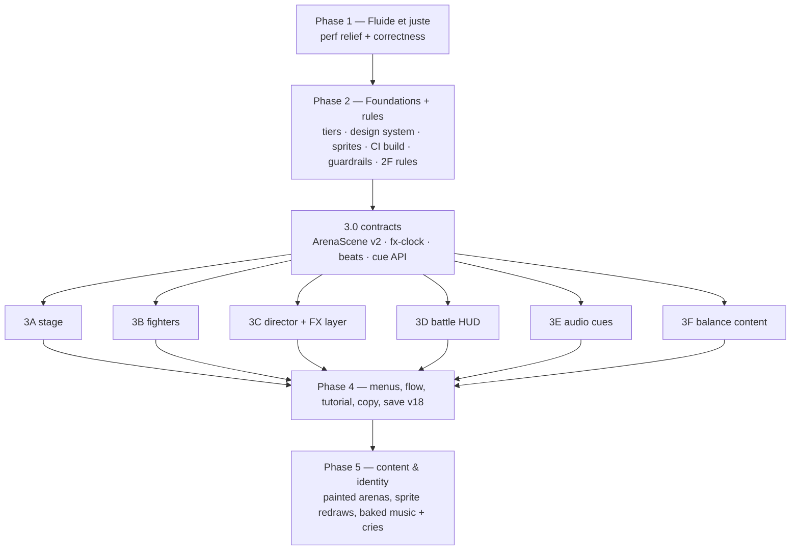

# Arène de Noam — State-of-the-art upgrade plan (Sept 2026)

Status: implementation plan, ready to execute. All owner decisions were settled on 2026-09-29 (§5). It consolidates six parallel expert reviews run on 2026-09-29: performance, battle stage art/rendering, combat VFX/motion, interface/UX, gameplay, and audio. It supersedes `arene-de-noam-visual-upgrade-plan.md` (repo root). That plan is mostly implemented, and the rest is folded in here.

Evidence lives in the gitignored scratch area `agents/review-2026-09/<slug>/REPORT.md` (`perf`, `stage`, `vfx`, `ui`, `gameplay`, `audio`), with harnesses, screenshots, mockups, prototypes and WAV renders next to each report. Lever IDs (`PERF-01`, `STAGE-06`, `VFX-04`, `UI-02`, `GAME-03`, `AUD-02` …) refer to those reports. The key numbers are restated below so this plan can be used on its own.

---

## 0. Verdict

**Why it is slow on the nephew's phone (measured, not guessed).** No single bug causes it. The game renders like a desktop showcase all the time:

| # | Root cause | Evidence |
|---|---|---|
| RC1 | The pipeline runs at 120 Hz even when idle. `ArenaScene.animate()` renders every rAF unconditionally (`src/presentation/arena.js:598-599`). 6 infinite CSS loops run on the idle battle screen and 9 on the title. | Idle battle: 120 WebGL renders/s and 120 style recalcs/s. At 6× CPU (≈ Helio G99) the main thread is 42–79 % busy. The GPU process uses 78 ms/s of host CPU. |
| RC2 | WebGL fill: full screen, full DPR 2, `antialias:true`, PBR on 59 transparent meshes, 2 point lights, ACES (`arena.js:89-101, 465`). The DPR cap never triggers on phones. | Drawing buffer is 720×1600 with 4× MSAA. 57 % of those pixels are hidden under the HUD. The analytic estimate on a Mali-G57 is ≈ 6–8 ms/frame [INFERENCE]. |
| RC3 | DOM churn on every event. The HUD and `#fx-stage` are rebuilt with `innerHTML`, and FX classes are toggled on the `#screen` root. | 1,525 elements inserted per turn. At 6×: up to 13 long tasks (1.2 s) per turn and FPS p5 of 13. |
| RC4/5 | Non-composited keyframes (`left/top`, `box-shadow`) and full-screen GPU effects: `backdrop-filter` over the live canvas, canvas `filter` on every attack, `blur(16px)` on exit. | Removing the switch-overlay blur and the pulse cuts GPU-process work from 129 → 25 ms/s and main-thread work by 75 %. |
| RC6 | 76 Unicode glyphs used as icons trigger font-fallback shaping. | 272 ms of `FallbackFontForCharacter` at 6×. |
| RC7 | Load path: a 7-deep module waterfall; Three.js (181 KB gzip) sits on the title's critical path; no service worker. | 3.0 s to the title on slow 4G. |

Gameplay logic is **not** a cause (AI ≤ 2.1 ms per decision on desktop). Audio is a secondary cost (scheduler < 0.3 % of wall time), although main-thread stalls do threaten its scheduling. A measurement-only low-tier prototype already reached −55 % main-thread ms/frame at idle, −75 % on the switch overlay, −30 % during a turn, and −71 % GPU-process CPU at idle.

**What looks cheap (taste verdict).**
- **Stage.** The stage is programmer art: six recoloured copies of one dais built from flat primitives (party-hat cones, torus-knot "flowers"). There is no sky, stands, crowd or battle pads. A rotation-order bug tumbles the floor rings through the floor (`arena.js:186` + `:568`).
- **Fighters.** They are DOM `` layers pasted over the canvas. They float (Calderoc sits ≈ 100 px above its shadow), are unlit, render at fractional pixel scales, and wear permanent orbs and rings.
- **Sprites.** The 30 sprites come from three production families. Only 8 match the canonical Orakyn pixel style; 22 are soft-alpha image-gen art with 4k–9k colours.
- **Combat FX.** All 90 moves share one 7-layer DOM scaffold, so a player sees about 5 silhouettes. The payoff is broken:
  - damage numbers are mostly at opacity 0 because they inherit an animation started at move-start;
  - projectiles park on the target;
  - the HP bar jumps instead of draining;
  - 7.5 % of hits lose or misplace their impact;
  - 3D bursts spawn off-screen on portrait phones.
- **Battle HUD.** It reads like a desktop dashboard shrunk to a phone. In the default mode, 48 of 96 words are 10–11 px and move names are 10 px. Chrome takes 258 px of the 800 px height. The stage gets 341 px. There are 0 `:active` press states. The Android back gesture leaves the game mid-battle.
- **Audio.** The music is a quiet ambient generator (≈ −35 to −38 LUFS), and impacts put 95–98 % of their energy below 250 Hz, which disappears on a phone speaker. The victory fanfare is cancelled by the screen transition. The reverb bypasses the volume sliders. The adaptive-music setter is never called.
- **Gameplay.** It is already very Pokémon-like: same six type arrows, speed and priority, switching, the Champions 3v3 singles format, and Legends Z-A–style cooldowns without accuracy. But the headline mechanics are rare or flat:
  - Combos fire 0.11× per battle;
  - 9 of 30 Signatures deal no damage;
  - the Apprentice AI random-switches 3× per battle;
  - the arena rule copy states wrong numbers (8 / 8 % / 5 vs engine 5 / 5 % / 3, `src/i18n.js:926-928` vs `src/battle/engine.js:963-968`).

**North star — "Stade Lumière".** A pocket-sized HD-2D stadium built for a $200 phone:
- crisp pixel creatures standing on lit battle pads inside a baked, unlit stadium diorama with a crowd, a landmark and a sky;
- one camera fitted to the stage box;
- event-driven FX on a pooled GPU layer;
- a Pokémon-familiar HUD with big type-coloured move tiles;
- a readable ~2 s turn;
- a mix you can hear on a phone speaker.

It must hold 30 fps idle / 60 fps FX on a Mali-G57 without heating the phone.

**The ten biggest levers, in value order:**
1. Frame governor + quality tiers + removal of full-screen GPU effects (PERF-01/02/03/04/07). This gives immediate fluidity.
2. "Stade Lumière" stage rebuild with the camera fitted to the stage (STAGE-06/02/05). The prototype costs 2.2–3.6× less GPU work.
3. Fighters rendered in WebGL with a small shader, keeping DOM proxies (STAGE-07). This fixes grounding, lighting, flash, dissolve and outline.
4. Impact readout fix and HUD patching (VFX-01/02, PERF-06): numbers, HP drain, and "Super efficace !" / "K.O. !" stamps.
5. Battle HUD rebuilt around genre conventions (UI-02/03/04/07): 2×2 type tiles at 16–17 px, diagonal plates, pause sheet, narration box.
6. Data-driven choreography director on a pooled WebGL FX layer (VFX-04/05/06/07): 15 archetypes, ~2 s turns.
7. Sprite consistency pass with no new generation (STAGE-03/04).
8. Design system (UI-05/12/13): self-hosted Baloo 2 + Nunito, one SVG icon family, opaque "ledge" surfaces.
9. One-screen team select and a title mode hub (UI-06/09/10).
10. Gameplay familiarity pass (GAME-01/02/03/04) and audio correctness plus mix (AUD-01/02/03).

---

## 1. Targets and budgets (definition of done)

**Target device.** The nephew plays a **Samsung Galaxy A-series** phone (model unknown), held in portrait, with the game served from GitHub Pages. That means a Helio G99 / Exynos 1330 / Dimensity 6300 with a Mali-G57 MC2 or G68 GPU, 4–6 GB RAM, a 720×1600 panel at 90–120 Hz and Chrome for Android. The worst case is the A14 class: Exynos 850 / Helio G80 with a Mali-G52. The CSS viewport is 360–412 × 800–915 at DPR 2–2.625. A 6× CDP CPU throttle ≈ the G99 main thread (Geekbench 6 ratio 4290 / 717); 8× is the A14-class stress check. There is no remote debugging and no on-device overlay (owner decision), so gates rely on emulation plus the owner's playtest. Desktop is supported but secondary.

| Area | Budget (Low tier on the target) | Baseline today |
|---|---|---|
| Main thread, battle idle (6×) | ≤ 1.5 ms/frame, 0 style recalcs per frame | 3.5–6.6 ms, 120 recalcs/s |
| Main thread, during a turn (6×) | ≤ 6 ms/frame; **0 tasks > 50 ms**; ≤ 300 elements inserted per turn | 8.6–21 ms; 1–13 long tasks; 1,525 inserted |
| Arena (WebGL) | ≤ 30 renders/s idle (60 during FX on mid); 0 under overlays; ≤ 12 draw calls; 0 lights/PBR; backing ≤ 0.35 Mpx on Low | 120/s; 15–30 draws; PBR + 2 point lights; 1.15 Mpx + 4× MSAA |
| Compositing | ≤ 10 layers idle, ≤ 16 during FX; no `backdrop-filter`, blur or drop-shadow filters over or on the canvas | 20 idle, 48 mid-attack (8.7 viewports of layer area) |
| Transient FX | ≤ 96 GPU quads live on Low; DOM carries text only | 25–48 DOM nodes per event |
| Load (slow 4G, cold) | Title ≤ 1.5 s, ≤ 150 KB gzip on the critical path; repeat visit ≤ 0.5 s; offline works | 3.0 s; 369 KB; no service worker |
| Turn pacing (×1) | Median turn ≤ 2.4 s, p90 ≤ 3.5 s; ≤ 3.5 narration lines per turn | ≈ 4.0 s median, 5.8 s p90; 6.85 lines |
| Readability (360×800) | 0 words < 12 px on decision surfaces; move names ≥ 16 px; stage height ≥ 420 px | 48/96 words at 10–11 px; stage 341 px |
| Taps | Title → first battle action ≤ 3 (League/Quick), Draft ≤ 5 | 3 / 6–12 |
| Menus | Team select fits one viewport; tap INP < 150 ms at 6×; bestiary < 800 DOM nodes | 7.95 viewports, 1,146 nodes, 200–456 ms; bestiary 2,206 |
| Audio | 0 late music steps across screen changes at 6×; category sliders control wet + dry; music bed ≈ −24 to −20 LUFS, true peak ≤ −1 dBTP; fanfares play in full | 2 late steps per transition; wet bypasses sliders; −35 to −38 LUFS; fanfare cancelled |

These budgets are the phase gates. The reusable harness is `agents/review-2026-09/perf/run-all.sh` (moved into `tools/perf/` in Phase 2). **Baseline caveat:** the "today" numbers were captured while five other reviewers drove Chromium on the same host. They are medians plus quiet-host pairs, but contention inflates throttled frame-time and long-task figures unpredictably. Before Phase 1, re-run `run-all.sh base` serially on an otherwise idle machine and record that condition; that run becomes the official baseline for every gate comparison.

**Measurement validity (no real-device instrumentation).** CDP throttling slows only the renderer main thread. Compositor, Viz and GPU-process timings measured on the Apple-silicon host run unthrottled on a GPU roughly 100× faster than a Mali-G57, so they **cannot validate the phone** (for example the "129 → 25 ms/s" figure above is directional evidence only). Two kinds of gate follow from this:
- **Measured gates are main-thread only:** ms/frame, long tasks, style recalcs and INP at 6× (8× stress).
- **Every GPU-side gate is a design-time constraint, checked statically or by probe:**
  - drawing-buffer Mpx and effective DPR;
  - MSAA off on Low/Mid;
  - draw calls, programs, lights (0) and transparent-mesh count;
  - estimated overdraw (summed screen area of transparent quads per frame);
  - composited layer count and area (CDP LayerTree);
  - no `filter`/`backdrop-filter` on or over the canvas (CSS contract plus a computed-style probe);
  - arena renders per second at idle and 0 while a sheet covers the stage.

  These are architecture properties, identical on the host and the phone.

---

## 2. Cross-area decisions (conflicts resolved)

| Topic | Reviewer positions | Decision |
|---|---|---|
| Quality tiers | PERF-03, STAGE-05 and VFX-11 each proposed a tier system | **One** `src/app/quality.js` (PERF-03). It is the single source for the arena budget (STAGE-05 table), the FX budget (VFX-11), CSS cuts (`html.q-low/mid/high`) and audio. Detection uses `deviceMemory`, the `WEBGL_debug_renderer_info` GPU regex and `saveData`, plus a runtime frame governor. `hardwareConcurrency` alone is useless because a G99 reports 8 cores. The user override "Graphismes : Auto / Économie / Standard / Élevé" is added in save **v17**. |
| Save migrations | Quality (PERF/STAGE/VFX), haptics (AUD-08), shinies (GAME-11) | **v17** (Phase 2) carries `quality` only. **v18** (Phase 4, unit 4G) batches `haptics` (default off) and the per-creature Chromatique display preference. Chromatique *unlocks* and badge gating are derived from existing mastery and ladder counters, so they need no stored field. No dead fields are added ahead of their feature. |
| Fighter rendering | STAGE-07 WebGL quads; PERF-07 drives the DOM idle bob from the arena tick | **WebGL fighters (STAGE-07)** with visually hidden DOM proxies (`#fighter-*[data-creature]`, alt text) for accessibility and e2e. PERF-07's DOM-bob adapter is skipped to avoid throwaway work. In Phase 1 the transform-only fighter idle is kept (phase-offset) and every other idle loop is removed. |
| Creature scale vs stadium | Stage prototype shrinks creatures on desktop; UI mockup keeps them large | **Balanced (owner decision).** In portrait the player fighter is ≈ 65–70 % of stage height (near, bottom-left) and the enemy ≈ 55–60 % (far, top-right), with the stadium visible around them. Portrait is the primary layout (the nephew plays upright); landscape stays supported. |
| Camera | STAGE-02 3D shot system; VFX camera grammar as CSS classes | `ArenaScene` owns the camera (`shot(name, opts)`, `punch()`, colour-grade uniforms). The CSS `.battle-stage-camera` transforms and canvas filters are retired. The move grammar names (`strike/rush/heavy/ultimate`) stay as the public vocabulary and map to shots. |
| FX substrate | VFX-05 GPU layer; PERF suggested reusing the `burst()` pool | **New instanced FX layer** (`src/presentation/fx-layer.js`: 1 draw call, 1 atlas, fixed-dt integration, anchored to fighter anchors). The single 180-point `burst()` pool is retired. DOM keeps only text (numbers, stamps, narration, cut-in banners). |
| Presentation contract | Today "every move has a `.move-<id>` CSS rule" | Replaced by "every move has a `MOVE_FX` entry with a valid archetype and motif, and a creature's 3 moves are not all the same archetype" (VFX-04). Update `test/presentation-contract.test.js`, `CLAUDE.md` and `docs/README.md` in the same change. Type/class/status palette + geometry disjointness stays. |
| Pacing and narration | VFX-06 beats plus tap-to-hurry at ~2 s turns; UI-07 narration box with ≥ 900 ms per line and no tap-to-advance | **~2 s turns with hold-to-hurry (owner decision)**: holding the stage runs the clock at ×3, and readouts stay visible at least 350 ms. **×1 stays the default** after the tutorial. There is one narration line per action beat (≈ 2 per turn), shown for the beat's duration. Effectiveness, K.O., "Coup critique !" and "Bloqué !" ride on the stage as stamps, so the text never carries them alone. Engine determinism is unaffected because the turn is already resolved. |
| HP bar | VFX-01 and UI-03 | One implementation: `transform: scaleX()` drain over 450 ms, a lagging ghost chunk, and 3 states (> 50 % green, 20–50 % yellow, < 20 % red). Patched in place, never rebuilt. |
| HUD rebuilds | PERF-06, VFX-02, UI-03 | `refreshBattle()` splits into `patchHud()` / `patchFighters()` / `renderCommands()`. During playback only the patches run. |
| Overlays | UI-04, PERF-04 | Opaque bottom sheets (solid scrim, no `backdrop-filter`) for switch, replacement, plate details, move info and pause. The arena pauses rendering while a sheet covers it. |
| Icons | UI-12, PERF-10 | One inline SVG `<symbol>` sprite (24 grid, 2.2 px round stroke) with an `icon(name)` helper. No emoji or Unicode pictographs in the UI. Chrome icons must stay visually distinct from the type/class/status geometry. |
| Vocabulary | GAME-01 ("Jauge Signature", Esquive, DÉF, badges, "utilise … !") and UI-11 ("✦ Super-attaque", "Recrutement du jour", "Expédition") | **Settled by the owner; applied by one glossary owner in Phase 4F:** • Gauge = **Signature ✦**; drop Éclat / Surge / Déchaîner. • Insaisissable → **Esquive**; GRD → **DÉF**. • Narration "**X utilise Y !**" / "**X est K.O. !**"; emblèmes → **badges**. • Draft du jour → **Pioche du jour**; Traversée → **Expédition**. • Unite-style classes: Rempart → **Défenseur**, Assassin → **Rapide**, Soigneur → **Soutien**, Contrôleur → **Stratège**, Briseur → **Attaquant**, Duelliste → **Polyvalent**. Class SVG geometry and colours are unchanged, so the presentation contract is untouched. • "Sonné" stays; there is no turn-skipping paralysis. • Originality guard: generic words only. Never copy full franchise catchphrases ("C'est super efficace !", "Que doit faire X ?"); keep "Super efficace !". |
| Combo | GAME-03 universal Marqué ×1.3; UI-06 removes combo-route panels | Adopted. The engine change lands in Phase 2F, so every Phase 3 presentation shows ×1.3. The combo-route panels disappear with the team-select rebuild in 4B. |
| Rules timing | Gameplay levers were spread over Phases 4–5 | **Rules land before presentation.** Every approved rule that changes engine events or HUD content lands in **Phase 2F**, alongside the foundations: • Apprentice level gap; • crits; • arena weather replacing the 4-turn pulses; • universal Marqué.  Phase 3 then builds its HUD and FX for the final rules. There is no countdown chip, pulse beat or +40 % text to throw away. Balance content (coverage moves, Signature payoff, healers) runs in parallel with Phase 3 as **3F**: data-only, with move palettes following `move.affinity` automatically. |
| Arena weather (GAME-08, approved) | Pulses every 4 turns vs continuous type weather | Each arena gets a continuous, engine-owned type rule (e.g. Forge du volcan: Feu +20 %, Plante −20 %; Crystal stays neutral), shown before team select and as a HUD badge. Previews include the multiplier through the engine, so it is parity-tested. `rapid_arena` users need replacement rules: • Quick rule `pulse_rush`; • Circuit `awakening`; • Trial `eruption`; • Gauntlet stage 2.  The `arena_master` feat needs a new condition, and the balance sim gains arena coverage. |
| Critical hits (GAME-09, approved) | Pokémon crits vs exact previews | Seeded 1/16 at ×1.5, flagged `critical:true` on the damage event, with a "Coup critique !" stamp and SFX. Previews show the non-crit value, and preview-parity tests compare non-crit hits. **Apprentice-tier rivals never crit the player.** The extra RNG draws shift seeded outcomes, so seed-pinned engine tests and e2e scenarios are re-baselined in the same change. |
| K.O. flash | VFX-08 removes the full-screen white flash | **Softened, kept (owner decision):** full-screen white ≤ 0.3 opacity for ≤ 150 ms, never stacked with other flashes, and absent under reduced motion. It is layered on the target-local flash, dissolve and "K.O. !" stamp. |
| Sprites | STAGE-03 quantise to ≤ 100 colours + binary alpha; PERF suggested WebP lossless | **Adopt STAGE-03 with per-sprite tuning (owner approved).** Then redraw the noisiest 4–6 with PixelLab in Phase 5B (owner approved). Keep PNG, since indexed pixel art compresses well. Re-measure bytes afterwards; WebP only if PNG stays > 500 KB total. |
| Music | AUD-05 bakes original synth music to Opus offline; brief §10 says "generated in-browser or authored from simple synthesis" | **Bake music offline (owner decision)** with a dev-only export tool; the editable synth source stays in the repo. Identity: **bright melodic synth / chamber** built on one original motif. The UI/SFX stay live-synthesised but revoiced (AUD-03). Cries play on entry, Signature, faint, and when a creature is picked in team select, never on ordinary attacks. The scheduler fix in Phase 1 is minimal, because baking removes the note timer. |
| Stage lighting | Brief §10 says "dynamic lighting"; STAGE-06 is baked and unlit | Baked lighting plus uniforms (grade, rim, flash) is a deliberate brief amendment for the target GPU. The procedural plate painter ships first; painted plates follow in Phase 5. |
| Build step | PERF-15 optional bundler; brief forbids a production build | **Allowed, CI-only (owner decision).** Sources stay runnable unbundled for development (`npm run serve`, tests, e2e). The existing `.github/workflows/pages.yml` (it uploads the repo root today) gains a build job: • an esbuild bundle and minify with a lazy Three.js chunk; • content-hashed filenames; • the service-worker precache list; • deployment of `dist/` to GitHub Pages.  The nephew only ever sees an installable, offline-capable web app on his phone browser. This replaces the dev-time `modulepreload` generator. |
| Device calibration | Remote debugging and an on-device perf overlay were both proposed | **Neither is available (owner decision).** The target is a **Samsung Galaxy A-series** (model unknown). Plausible SoCs: • Helio G99 / Exynos 1330 / Dimensity 6300, with Mali-G57 MC2 or G68; • at worst Exynos 850 / Helio G80, with Mali-G52 (Galaxy A14 class).  Gates therefore use emulation at 6× CPU, plus an **8× stress check** for the A14 class. The GPU budget comes from analysis, not measurement. The owner's playtest on the phone (smoothness, heat, battery) is the final judgement. The tier-detection regex must classify every Galaxy A GPU above as Low. |

**Brief amendments, approved by the owner on 2026-09-29.** Record each one in a short "Amendments" section in `docs/README.md` when it ships:
- baked stage lighting;
- baked music;
- WebGL fighters (this matches the brief's original "sprites on planes");
- the presentation-contract change;
- a CI-only build step;
- seeded critical hits;
- the Apprentice level gap;
- Chromatiques plus badge-gated side modes;
- coverage moves;
- arena weather.

---

## 3. Phased plan

Rules for every phase:
- Parallel units have **disjoint file ownership** as listed.
- `src/i18n.js` has exactly one owner per phase. Other units append their new keys in a clearly delimited per-unit block at the end of **both** dictionaries, and the owner merges them at the gate. The keys are pre-specified where known.
- Subagents edit only. The orchestrator runs the gates and `npm run format` once per phase.
- Each phase ends green before the next starts.
- Contract changes update `docs/` and `CLAUDE.md` in the same phase.

### Phase 1 — "Fluide et juste": perf relief and correctness (≈ 2–3 agent-days, 7 parallel units)

No save change, no contract change. This phase gives the nephew a visibly smoother game immediately.

| Unit | Owns (files) | Work (lever refs) | Acceptance |
|---|---|---|---|
| **1A Arena render policy** | `src/presentation/arena.js`, `src/battle-ui/controller.js` (pause hooks only) | See 1A details below. (PERF-01, PERF-02 interim, PERF-13, STAGE quick wins 1–2, 8, VFX quick wins 8–9) | Battle idle `webglRendersPerSec` ≤ 31 and 0 with the switch sheet open. No `PointLight` in the scene. Rings stay flat after 60 s. Bursts land within ±20 px of sprite centres at 360×800, 412×915, 800×360 and 1440×900. |
| **1B FX readout + FX CSS substrate** | `src/battle-ui/fx.js`, `src/battle-ui/playback.js`, `styles/screens/battle-fx.css`, `styles/screens/battle-presentation.css`, `styles/screens/battle-combos.css` | See 1B details below. (VFX-02, VFX-03 partial, VFX quick wins 1–7 and 10, PERF-04/05 FX parts, AUD quick wins 2, 3 and 5) | At 360×800 every non-lethal hit shows its number at ≥ 0.9 opacity for ≥ 450 ms, including multi-hit hits and Signatures. `fx-loss-sim` gives 0 lost / 0 misplaced. No `filter` on `#arena` during playback. The attack-turn trace has no composite failures with reason 8192/4096 in these sheets. |
| **1C Persistent battle-state CSS** | `styles/components.css`, `styles/screens/progression.css`, `styles/screens/accessibility.css` | See 1C details below. (PERF-04, PERF-07, STAGE-01, STAGE quick wins 4–7, UI-01 Trials) | Idle battle at 6×: ≤ 2 running CSS animations. Title → Épreuves at 360×800 shows one readable card per row. No `backdrop-filter` in these sheets. |
| **1D Copy truth + UI bugs** (i18n owner) | `src/i18n.js`, `src/screens/league.js`, `src/screens/results.js`, `src/battle-ui/hud.js`, `src/screens/draft.js` | See 1D details below. (GAME-01 part 8 + quick wins, UI-01, UI quick wins 9–12, AUD-01 call site) | i18n parity green. Each key is defined once per language. **The resolved `t(key)` map for every key in both languages is byte-identical before and after the dedupe** (throwaway dump script; intended copy fixes are applied as a separate, listed diff). No `[KEY]` / `⟦key⟧` on any screen. Long-press in simple mode opens info. |
| **1E Menu CSS + mobile shell** | `styles/base.css`, `styles/overrides/selection.css`, `styles/screens/gauntlet.css`, `index.html`, new `manifest.webmanifest` + `assets/icons/` | See 1E details below. (UI quick wins 7–8 and 13, UI-01 results, PERF-12, PERF-07 title) | A press shows a visible 2 px drop within one frame. Team select: ≤ 12 layers, ≤ 25 MB. Results ≤ 15 layers after the reveal. Chrome offers "Install". |
| **1F Audio correctness** | `src/sound.js`, `test/audio.test.js` | See 1F details below. (AUD-01 sound side, AUD-02 routing + gain staging, AUD-04 minimal, PERF-11) | Real victory **and** defeat captures contain all 4 sting notes. Each slider at 0 removes its category's wet tail. `audio-probe.mjs --rate 6` gives 0 late steps. Representative normal / Signature / K.O. stacks ≤ −1 dBFS true peak. |
| **1G AI pivot fix** | `src/battle/ai.js`, AI tests in `test/data-ai.test.js` | Standard switch bias 17 → 5 (`ai.js:241`; measured at 0: greedy win 51 %, in band). The Apprentice rework lands with the rules pass in 2F. (GAME-02 part, GAME quick win 5) | `npm run test:balance` and `--naive` bands green. Standard-vs-Standard turn cap ≤ 9 %. |

**1A details.**
- `animate()` time-gated at 30 renders/s ambient and 60 active, with the active state computed from burst, camera kick and tension/showdown lerps.
- `setPaused(bool)`, called from `openSwitch`, `openBattleCodex`, `openBattleLog`, `openPlateDetails` and battle exit.
- On coarse pointers: `antialias:false` and `setPixelRatio(min(DPR, 1.5))` (1.0 when `deviceMemory ≤ 4`).
- Delete `fxLight` (the permanent `PointLight`) and the rim `PointLight`; the flash becomes an exposure bump.
- Fix the ring tumble: spin around the world Y via a parent `Group`.
- Frame-rate-independent decays: `Math.pow(k, dt*60)` (`arena.js:554-556, 593`).
- Burst origin projected from the fighter DOM rect, with separate burst pools.
- `forceContextLoss()` in `dispose()`.

**1B details.**
- Restart `.damage-number` animation at impact.
- Hide projectile and trail on impact.
- Consumed statuses never rebuild `#fx-stage`; `impactMoveFx` keeps its own node reference; clear only at action-beat boundaries.
- Clamp "K.O." and callouts inside the stage; callouts become 20 px on a solid pill.
- "Bloqué !" replaces "perd 0 PV / −0" (keys `battle.blocked` FR "Bloqué !" / EN "Blocked!", appended for 1D).
- Drop the `move-skip` line after a K.O.
- Delete the `.cinematic .arena-canvas` filter (`battle-fx.css:626-633`); `.battle-exit` becomes opacity only.
- Flight keyframes move from `left/top` to `translate(var(--fx-dx), var(--fx-dy))`, with the vector computed once in `beginMoveFx`; trail angle and length also computed there.
- Remove `drop-shadow` from `dangerIdle`; `box-shadow` pulses such as `statusBurningPulse` become a static glow with animated opacity.
- Move the `.trial-grid/.trial-card/.bestiary-grid` responsive rules out of `battle-presentation.css:1191-1245` (1C re-adds them).
- Audio in `playback.js`: no creature cry on ordinary move-start; `shatter()` on `barrier-break`; the victory cry no longer depends on reduced motion.

**1C details.**
- `.replacement` gets a solid `#040617e6` scrim instead of `backdrop-filter: blur(5px)` (`components.css:331-339`). Same for the settings overlay (`accessibility.css:333`).
- `showdownGlow` and `arenaWarning` animate the opacity of a static glow layer.
- Fighter image `drop-shadow` removed; the blob shadow uses a radial gradient instead of `blur()`.
- Hide on-body `.status-orbits` in battle; statuses stay on the plates.
- `statusFloat` and `masteryAura` become static.
- Enemy idle offset by `animation-delay:-1.1s`.
- `object-position: 50% 100%` puts the feet on the shadow.
- Add the Trials/Bestiary responsive rules to `progression.css`.

**1D details.**
- **First:** collapse the `Object.assign` layers (`i18n.js:905, 1268, 1625, 1690, 1755, 1930, 2103, 2201`) so every key is defined once (164 FR / 162 EN shadowed definitions), with no wording change. **Keep the last definition of each key**, because later layers win at runtime. `validateDictionaries()` compares key sets only, never values, so a wrong pick would change live copy while the tests stay green. Dump every resolved `t(key)` for both languages before the edit and assert byte-identical output after it.
- Then:
  - arena rule copy 8 / 8 % / 5 → 5 / 5 % / 3 in FR and EN;
  - add the `league.route` key;
  - count-aware plurals ("1 cible favorable");
  - remove the ".." in the draft kit insight;
  - Draft reveal labels the rival, not the arena;
  - add `.move-context-source` to the simple-mode template (`hud.js:315`);
  - results: no grade and no "0/100" on defeat (`results.js:329`); move `sound.victory()/defeat()` after `bindCommon()`;
  - drop the duplicated title eyebrow;
  - merge keys appended by other units.

**1E details.**
- Global `button:active { transform: translateY(2px) }` plus ledge collapse, and every `:hover` motion wrapped in `@media (hover:hover)`.
- `html,body { overscroll-behavior:none }`; `user-select:none; -webkit-touch-callout:none` on the battle screen, cards and sprites.
- Team dock: solid background, no blur; scroller gets `contain: paint`; cards get `content-visibility:auto`.
- Results squad report stacks at ≤ 600 px (`gauntlet.css:154-168`).
- Results reveal classes removed on `animationend`.
- Title: at most 3 motes, no infinite drift on `(pointer:coarse)`.
- Manifest: `display: fullscreen`, standalone fallback, theme `#0b0d24`, 192/512 maskable icons from an existing sprite.

**1F details.**
- Results sting ownership: `setScreen` cancels stale battle SFX **before** the new screen's sting, and the 500 ms wall-clock suppression becomes a battle-session token check.
- Reverb sends move after the category level, theme, duck and tension controls, so sliders, fades and ducks control wet + dry.
- Gain-stage the music bed toward −24…−20 LUFS offline with the render harness (`agents/review-2026-09/audio/render.mjs`).
- Scheduler horizon 0.12 → 0.25 s, and stale steps are skipped instead of fired in a burst.
- On hidden, cancel SFX as well as music.
- Update the constants pinned in `test/audio.test.js`.

**Gate 1:**
- `npm test`, `npm run test:balance` (+ `--naive`), `npm run test:e2e`.
- Perf harness, paired runs at 6× (main thread): battle idle ≤ 2 ms/frame; switch sheet ≤ 2 ms/frame.
- GPU design constraints (probe): on coarse pointers, AA off and DPR ≤ 1.5; 0 point lights; arena renders ≤ 31/s at idle and 0 while the switch sheet is open; no `backdrop-filter` or canvas `filter` in any computed style during a battle.
- Screenshots of battle, switch, results and Trials at 360×800 in FR, plus one EN check.
- 8× stress run on battle idle and one attack turn (Galaxy A14 class): no task > 100 ms.
- Owner playtest on the phone: smoothness, heat after 10 minutes, and whether it feels faster than before.

### Phase 2 — Foundations + rules (≈ 1.5 agent-weeks, 6 parallel units)

These produce the contracts Phases 3–4 consume. 2F lands every approved rule change that alters engine events or HUD content, so Phase 3 builds the presentation for the final rules.

| Unit | Owns | Work | Acceptance |
|---|---|---|---|
| **2A Quality tiers** (i18n owner) | new `src/app/quality.js`, `src/save.js`, `src/screens/settings.js`, `src/i18n.js`, `test/i18n-save.test.js`; tier-consumption edits in `src/presentation/arena.js`, `src/battle-ui/fx.js`, `src/sound.js` | See 2A details below. (PERF-03, STAGE-05 table, VFX-11) | `?quality=low` meets the §1 idle budget at 6×. The governor demotes within 5 s under an injected 30 ms/frame busy loop. v16 → v17 migration, round-trip, corrupt-save and future-save tests are green. |
| **2B Design-system foundation** | `styles/tokens.css`, new `fonts/` (Baloo 2 + Nunito Latin subsets, OFL, 28.8 + 31.9 KB WOFF2), new `src/app/icons.js`, `src/app/shell.js` (bottom-sheet helper reusing `trapModalTab`, topbar icons) | Full token set: type scale 12/14/16/18/22/28/44, surfaces, elevation "ledge", radii, motion, z-index, 3 breakpoints (≤ 600, ≤ 1000, height ≤ 480). `@font-face` with `swap`. SVG symbol sprite (~27 icons) and `icon(name)`. Bottom-sheet component (grab bar, 24 px radius, focus trap, Escape). Topbar/settings glyphs replaced. (UI-04 primitives, UI-05, UI-12, UI-13 groundwork) | `document.fonts` reports both families loaded on emulated Android. The sheet opens and closes by tap and Escape with focus restored. |
| **2C Sprite pipeline** | new `tools/normalize-sprites.mjs`, `assets/monsters/*/battle.png`, `assets/asset-manifest.json`, new `src/data/sprite-metrics.js`, originals preserved under `art/` | Dev-only deterministic pass: alpha ≥ 128 → opaque; OKLab median-cut to 48–64 colours with per-sprite tuning, especially for pastel sprites (Nymbloom, Florafae, Solflare) and warm sprites (Kordane lost warmth in the experiment); 1 px selective outline; feet baseline at row 125. Export `{bbox, footRow, sizeClass}`. (STAGE-03, STAGE-04 metrics) The owner approved the style; the orchestrator reviews the contact sheet for per-sprite regressions before commit. | Every sprite has binary alpha, ≤ 100 colours and footRow 125 ± 1. Visual mass is within ±12 % or matches its size class. |
| **2D Load path, offline and CI build** | `src/app/context.js`, `src/main.js`, `index.html`, `src/battle-ui/controller.js` (await arena load), `package.json` (esbuild devDependency; `build` script; also adds 2E's `perf` script), `.github/workflows/pages.yml`, new `tools/build.mjs`, new `sw.js` | See 2D details below. (PERF-08 1, 4; PERF-09; PERF-15 approved as CI-only) | Built `dist/` on slow 4G at 6×: title ≤ 1.5 s, cold JS ≤ 130 KB gzip, no Three.js chunk before team select. Second load ≤ 0.5 s with 0 network requests. Offline reload works. The Pages workflow deploys `dist/`. The `failWebgl=1` friendly error still shows. The e2e smoke passes against both source and `dist/`. |
| **2E Perf guardrails** | new `tools/perf/` (harness moved from `agents/review-2026-09/perf/`), new `test/css-perf-contract.test.js` | CSS contract: no `@keyframes` animating `top/left/right/bottom/width/height/margin/inset/box-shadow/border/clip-path/background`, or `filter` with `blur/drop-shadow`, except an explicit `.q-high` allowlist. The harness gains `--rates 8` and a `--dist` mode. (PERF-05 test, PERF-14) | `npm run perf -- --rates 6,8` prints the §1 table. The contract test is green in `npm test`. |
| **2F Rules pass** (approved gameplay that changes events/HUD) | `src/battle/engine.js`, `src/battle/damage.js`, `src/battle/ai.js`, `src/data/combos.js`, `src/data/battle-rules.js`, `src/data/circuit.js`, `src/data/trials.js`, `src/data/gauntlet.js`, `src/data/trainers.js`, `src/data/advice.js`, `src/battle-ui/playback.js` (crit narration line only), `src/battle-ui/hud.js` (Combo literals), `src/screens/results.js` (`arena_master` feat), `tools/simulate-balance.mjs`, `test/engine.test.js`, `test/data-ai.test.js`, `test/preview-parity.test.js`, `docs/battle-system.md`, `README.md`; copy changes handed to 2A as a key list | See 2F details below. (GAME-03, GAME-02, GAME-09, GAME-08) | See 2F details below. |

**2A details.**
- `detectTier()` sets `html.q-*` and `ctx.quality` budgets.
- `FrameGovernor` watches the arena rAF p90 plus long-animation-frame (LoAF) entries. It demotes between events and promotes only between battles.
- `?quality=` test hook.
- Settings row "Graphismes : Auto / Économie / Standard / Élevé", with hint "Économie : plus fluide sur les petits téléphones".
- Save **v17** `quality:'auto'` plus `migrateV16`.
- Arena options: DPR, AA, fps caps, dust. FX particle-budget multiplier replaces the coarse ×0.5 hack. Audio horizon and reverb per tier.

**2D details.**
- Lazy `import('../presentation/arena.js')`, prefetched on team select and awaited in `renderBattle` beside `ensureBattleStyles()`.
- `tools/build.mjs` (esbuild, run in CI and locally as `npm run build`) writes `dist/`:
  - minified ESM bundle with splitting, so Three.js and `arena.js` form a lazy chunk;
  - one CSS bundle for the eager sheets, with battle sheets kept lazy in their cascade order;
  - content-hashed filenames and a rewritten `index.html`;
  - copied assets;
  - a generated service-worker precache list.
- `.github/workflows/pages.yml` runs `npm ci && npm test && npm run build` and uploads `dist/` instead of the repo root.
- Service worker: versioned precache, cache-first, `skipWaiting`, and never registered under `navigator.webdriver`.
- Font preload for Nunito.
- `renderer.compileAsync` during the intro.
- Development stays unbundled (`npm run serve`).

**2F details.** One agent, sequential sub-steps, with a balance-sim run after each:
1. **Universal Marqué** (GAME-03): any damaging move consumes Marqué at ×1.3. Replace every hard-coded "+40 %" in the same change:
   - derive the `COMBO +40%` literals in `src/battle-ui/hud.js:295, 314` from `COMBO_DAMAGE_MULTIPLIER`;
   - hand 2A the i18n keys `battle.comboReady`, `battle.combo`, `status.effect.marked`, `tutorial.2` and every Combo `move.effect.*` line (FR and EN);
   - update `README.md` "Combo" and the `docs/battle-system.md` Combo contract.
2. **Trainer AI** (GAME-02): the Apprentice picks from moves only, plus a visible `rookie` level gap (enemy PV and ATQ ×0.85, shown as "Niv." on the rival plate once 3D lands) for Apprentice-tier League rivals, Quick Battle Apprentice and the tutorial.
3. **Seeded critical hits** (GAME-09): 1/16 at ×1.5, `critical:true` on the damage event, never for Apprentice-tier rivals against the player. Previews stay non-crit, and parity tests compare non-crit hits. Narration "Coup critique !" in `playback.js` until the 3C stamp lands. Re-baseline seed-pinned tests.
4. **Arena weather** (GAME-08): continuous per-arena type multipliers applied in `damage.js`, so previews include them. Remove `arenaPulse` and `rapid_arena`, and author replacements for Quick `pulse_rush`, Circuit `awakening`, Trial `eruption`, Gauntlet stage 2 and the `arena_master` feat. The sim gains arena coverage.

Acceptance:
- Crit rate 6.25 % ± 1 % over 10k seeded actions, with 0 Apprentice crits on the player.
- Combos ≥ 1.5 per battle for the greedy policy.
- Apprentice voluntary switches ≤ 0.2 per battle.
- Naive ramp bands: Apprentice ≥ 65 %, Standard 40–60 %, Champion 20–45 %.
- Roster 30–70 %, per-arena type win rates within ±8 pp, turn cap ≤ 5 %.
- No `40 %` / `40%` Combo reference left.
- Preview parity green.

**Gate 2:**
- `npm test` (migrations, parity, CSS contract, rules), `npm run test:balance` + `--naive`, `npm run test:e2e` on sources.
- An e2e smoke plus the load harness on `dist/`.
- Perf harness with `?quality=low|mid|high` at 6× and 8×.
- Normalised sprite contact sheet reviewed (per-sprite tuning checked, especially the pastel and warm sprites).

### Phase 3 — "Stade Lumière" battle presentation (≈ 3–4 agent-weeks)

**3.0 Contracts (serial, one agent, S–M).** Write `docs/battle-presentation.md` and the small real modules the others build on. The engine events are final after 2F: `damage.critical`, weather in `state`, and no `arena-pulse`.
- **`ArenaScene` v2 API:**
  - `anchors()` → `{player|enemy: {feet, center, head, sizePx}}`, also written as CSS vars `--player-x/y`, `--enemy-x/y`, `--*-size` on `.battle-stage`;
  - `fighter(side).{windup, lunge, hit, recoil, dodge, tint, ko, faint, recall, enter, victory}`;
  - `shot(name, {side, duration})`, `punch()`, `setGrade({saturation, exposure, contrast})`, `setPaused()`, `setBattleState()`, `dispose()`;
  - `fx.emit(emitter, opts)` for the FX layer.
- **`src/battle-ui/fx-clock.js`:** a rAF clock with rate = speed × hurry, pause (real hit-stop), cancel, and tier-aware budgets.
- **`src/battle-ui/beats.js`:** pure `groupBeats(events)` → `ActionBeat / KoBeat / SwitchBeat / Chip`, with unit tests. Rules (VFX report §3):
  - `barrier-hit` and consumed statuses merge into the ActionBeat;
  - trailing statuses become one chip row;
  - Surge is non-blocking;
  - a K.O. beat absorbs `move-skip`;
  - a critical hit adds a stamp and a tier bump to its ActionBeat;
  - `session.timeline` is still fed per semantic event.
- **Sound cue API** consumed by the director: `sound.cue('windup'|'contact'|'readout'|'critical'|'ko'|'effective'|'resisted'|'miss'|'status+'|'status-'|'break'|'heal'|'signature-ready', payload)`. The director dispatches cues through one cue bus. Sound subscribes in 3E; haptics subscribes in 4G, with no placeholder module before then.
- **HUD patch API:** `patchHud(side, view)`, `patchFighters()`, `renderCommands()`.

**Then six parallel units:**

| Unit | Owns | Work | Acceptance |
|---|---|---|---|
| **3A Stage** | `src/presentation/arena.js` (may split into `src/presentation/stage/*.js`) | See 3A details below. (STAGE-06, STAGE-02, STAGE-05, STAGE-09) | At 360×800 and 412×915 both pads and fighters are inside the stage and the landmark is visible. The WebGL buffer is ≥ 50 % smaller than today. ≤ 10–12 draws on Low. No `MeshStandardMaterial` or lights. `?animations=0` skips all shots. |
| **3B Fighters in WebGL** | new `src/presentation/fighters.js`; the fighter DOM in `renderBattle` (`src/battle-ui/controller.js`) becomes hidden proxies; the fighter CSS blocks in `components.css`, `progression.css`, `league.css`, `accessibility.css` are deleted | See 3B details below. (STAGE-07, STAGE-04) | Feet on pads for all 30 creatures (contact-sheet run). Hit flash and K.O. dissolve visible at 0.2× playback. Reduced motion: single-frame flash, fade instead of dissolve, no breathing. Proxies keep names. |
| **3C-1 Director + FX layer** | new `src/presentation/fx-layer.js`, new `src/battle-ui/director.js`, `src/battle-ui/playback.js` (rewrite onto beats), `src/battle-ui/fx.js` (retire stage rebuilds), new `#fx-text` DOM layer | See 3C-1 details below. (VFX-04 engine, VFX-05, VFX-06, VFX-01 full, VFX-07) | `timing.mjs` phone ×1: median turn ≤ 2.4 s, p90 ≤ 3.5 s. Holding finishes a 5-hit turn in ≤ 1.2 s. Mid-attack ≤ 16 layers. CPU 6×: ≤ 1 % frames > 33 ms during playback. Numbers and stamps are always inside the viewport. |
| **3C-2 Choreography content** | new `src/data/choreo.js`, FX atlas under `assets/fx/`, `test/presentation-contract.test.js` (new contract), retirement of per-move rules in `battle-fx.css` / `battle-presentation.css` | See 3C-2 details below. (VFX-04 content, VFX-08, VFX-09, VFX-10, VFX-12, VFX-13) | 90/90 moves resolve to a timeline. Contact sheet at 360×800: each archetype is nameable by its verb in a blind check. Signature beat ≤ 1.8 s with the number visible ≥ 450 ms. The switch never double-exposes. No full-screen white layer > 0.3 opacity. |
| **3D Battle HUD** | `src/battle-ui/hud.js`, the `src/battle-ui/controller.js` HUD/commands (after 3B's fighter changes), `styles/screens/battle-layout.css`, `styles/overrides/battle-command.css`, `battle-moves.css`, `battle-preview.css`, `styles/screens/battle-ace-log.css`, `e2e/battle-layout.spec.js` (re-baseline) | See 3D details below. (UI-02, UI-03, UI-04, UI-07, UI-16 battle, PERF-06, UI-08 wake lock) | At 360×800: stage ≥ 420 px; 0 dock words < 12 px; move names ≥ 16 px; tap targets ≥ 48 px; `confirm(` absent from `src/`. Move-tap INP ≤ 100 ms at 4×. ≤ 300 elements inserted per turn. Simple and expert expose identical legal actions. |
| **3E Audio cues** | `src/sound.js` | See 3E details below. (AUD-03, AUD-06 wiring only) | Screen-covered listening test distinguishes hit/miss, effective/resisted, crit, buff/debuff, heal/break. A multi-hit sounds like its real hit count. No audio precedes its visible event. |
| **3F Balance content** (runs alongside, data-only; **Phase 3 i18n owner**) | `src/data/moves.js`, `src/data/creatures.js`, `src/data/passives.js`, `src/i18n.js`, `tools/simulate-balance.mjs`, data tests | See 3F details below. (GAME-06, GAME-05, GAME-07) It also merges the key blocks appended by 3C/3D at the gate. | Every creature has exactly one off-type regular move. SE share ≥ 15 % for the greedy policy. Signature ratio test green. Healer class ≥ 45 %, Aubéastre ≥ 40 %. Roster 30–70 %, turn cap ≤ 5 %. Naive ramp bands green. Move effect copy matches the data in FR and EN. |

**3A details.**
- Unlit baked stadium: back-half cylinder plate (sky, landmark, crowd tiers, light towers with baked god rays), textured court with an original six-rhombus sigil, two oval battle pads with contact shadows. `MeshBasicMaterial` and small `ShaderMaterial`s only; `NoToneMapping`, no lights, no fog.
- Canvas limited to the stage box plus bleed; a static CSS plate sits behind the HUD zones.
- `fitToStage()` via `camera.setViewOffset`. Portrait diagonal staging: player near-left and larger, enemy far-right; creature-first framing per §2.
- Shots: intro fly-in 1.2 s, attack push, K.O. push-in, victory orbit ≤ ±12° yaw. Reduced motion turns shots into cuts.
- Colour-grade uniforms replace every canvas CSS filter.
- Atmosphere: GPU motes animated in the vertex shader; crowd flash-bulb pool fired on super-effective hits, K.O. and victory; floor reflection on mid/high only.
- Per-tier budgets from 2A. The prototype is in `agents/review-2026-09/stage/proto/stage.js`.

**3B details.**
- `FighterSprite`: `PlaneGeometry(1,1,1,8)` anchored at the feet, cylindrical billboard, `NearestFilter`, alpha-test `discard`.
- Shader: rim/grade, foot occlusion, `uFlash`, `uTint`, `uDissolve` (or sink-through-pad faint), `uOutline` (also the high-contrast outline), `uHue` (ready for variants), vertex breathing about the feet with a per-creature phase.
- Integer texel snapping from `sprite-metrics.js`.
- Visually hidden `#fighter-player/#fighter-enemy[data-creature]` proxies with alt text; the canvas stays `aria-hidden`.
- Rewrite `e2e/gameplay.spec.js:611-614` (switch ghost) to assert proxy attributes.
- The Move Theater keeps DOM fighters (a second path is accepted for a bestiary preview).

**3C-1 details.**
- `InstancedMesh` of camera-facing quads (≤ 96 / 160 / 256 by tier), one 1024² atlas, custom `ShaderMaterial`, fixed-dt CPU integration in preallocated buffers.
- Emitters: burst, ring, streak, beamQuad, pillar, rain, orbit, trailFollow.
- The director turns beats into cue timelines on the fx-clock and drives the sinks: GPU layer, fighter API, camera, DOM text, HUD patch, sound cues.
- `#fx-text`: pooled numbers, stamps and chain counter, animated with WAAPI transform/opacity and started at the contact cue. Stamps: "Super efficace !", "Peu efficace…", "Coup critique !", "Esquivé !", "Bloqué !", "K.O. !", 22–26 px on a solid pill, clamped.
- Contact choreography: attacker reach 55–70 %, target knockback, and a true hit-stop that freezes clock, fighters, particles and camera.
- Hold-on-stage hurry.
- `?animations=0` gives a readout-only path on a 1 ms clock.
- FX randomness uses `hash(moveId, turn, hit)`, never the engine RNG.

**3C-2 details.**
- 15 archetypes (DASH, SLASH, QUAKE, BEAM, PROJ, LOB, RAIN, WAVE, VORTEX, NOVA, HEX, GUARD, BOOST, HEAL, RELAY) × type palette × 3 intensity tiers × creature motif. `MOVE_FX` has 90 entries, mapped per the VFX report coverage table.
- Status loops on the fighter (Brûlure embers, Sonné stars, Enraciné vines, Marqué reticle, Accéléré speed lines, Esquive afterimage, Concentré eye glint, Riposte spikes), each ≤ 8 quads.
- Signature T3: a 450 ms cut-in band with the pixel-scaled sprite crop and the move name in FR at 28 px, then the tier-3 archetype.
- The Signature-ready banner appears once per creature; afterwards it is a HUD glint.
- Combo credit is a small "COMBO ×1,3" tag on the number instead of a stage takeover.
- K.O.: target-local flash plus dissolve plus a centred "K.O. !". The **softened** full-screen white is kept (≤ 0.3 opacity, ≤ 150 ms, never stacked, off under reduced motion). Victory: a "VICTOIRE !" banner plus a winner hop and GPU confetti anchored on screen.
- Switch: recall to a light point, an empty beat, then a drop with a dust ring, a squash and a "X, à toi !" banner; the HUD patches on landing.
- Portrait VS intro, ending on an arena weather banner (e.g. "Forge du volcan : Feu +20 %, Plante −20 %").

**3D details.**
- 2×2 dock: type-coloured move tiles (38 px type disc, name 17 px Baloo, effectiveness pill, 16 px damage number), a gold Signature tile with a fill bar, and a "Changer" tile with bench portraits. Descriptions move to a long-press info sheet. Previews are reused read-only, so preview parity is unchanged, and the `.move-<id>` classes are kept until 3C-2 switches the contract.
- Plates: enemy top-left and player bottom-right, 3-state HP with drain and ghost, exact HP numbers on both plates (owner decision), team balls, the rookie "Niv." handicap tag on Apprentice-tier rivals, and a thin gold ✦ meter on the player plate.
- Top row, 48 px: ⏸ pause, "Tour N" plus an arena weather badge (type icon + "+20 %"; tap for the rule), ×1/×2 (×1 default).
- Pause sheet: Comment ça marche ?, Journal, Vitesse, Son, Abandonner with an in-sheet confirm (replaces `confirm()`), Reprendre. `route.openBattlePause` is exposed for the back gesture.
- Coach chip appears only when usable.
- Narration box replaces the dock while locked.
- Switch/replacement bottom sheets with HP bars and Résiste / Neutre / Risqué verdicts.
- `refreshBattle()` split into patches.
- Wake Lock during battle.
- Landscape layout: stage left, 304 px dock right.
- Mockups are in `agents/review-2026-09/ui/mockups/shots/m-battle-*.png`.

**3E details.**
- One dominant cue per beat. Priority: impact / Signature / K.O. > identity > utility > UI.
- Six material families: Eau splash/droplet, Feu crackle, Plante papery pluck, Psy inharmonic bell, Combat woody midrange strike, Ténèbres breathy downward cut. Harmonics authored in the 0.7–3 kHz range.
- Effective / resisted / miss earcons, rising buff vs roughened debuff, a real shatter on break, an original 3-note Signature-ready motif.
- Multi-hit audio is synchronised to the real damage events.
- `sound.setBattleState` is driven by the *presented* state, with hysteresis. At most a one-time low-HP threshold cue; no alarm loop.
- A short original crit accent.
- Creature cries only on entry, Signature and faint in battle, plus team-select pick (4B calls it). Never on ordinary attacks.
- ×2 uses trimmed variants, never chipmunked cries.

**3F details.**
- **GAME-06 coverage moves:** retype one regular damaging move per creature to an authored second type from the other triangle (e.g. Calderoc "Jet de braise" → Combat), at −15 % power. Rename a move in FR and EN if its name contradicts the new type.
- **GAME-05:** every damaging Signature deals ≥ 1.6× its owner's best regular move at full HP against a neutral target. Every support Signature gets a team-scale payload or a damage rider. A data test encodes both.
- **GAME-07:** Aubéastre gets a light Psy attack; Nymbloom and Pactigon team heals go up ≈ 15 %.
- Re-run the sim after each step. Move palettes follow `move.affinity` automatically. `MOVE_FX` archetypes (3C-2) are independent of type, so 3C-2 needs no coordination beyond reading the final `moves.js`.

**Gate 3:**
- Full `npm test` (new presentation contract, beats tests, data tests), `npm run test:e2e` (re-baselined layout spec), `npm run test:balance` + `--naive` (3F targets).
- Perf harness at 6× Low: idle ≤ 1.5 ms/frame; turn 0 tasks > 50 ms on a quiet host.
- `timing.mjs` pacing targets.
- Archetype and arena contact sheets at 4 viewports.
- Reduced motion, `?animations=0`, high contrast.
- Owner/nephew playtest on the phone (there is no remote debugging, so this is the human gate for feel, heat and fluidity), plus the 8× stress run.

### Phase 4 — Menus, flow, tutorial, progression, copy (≈ 2 agent-weeks, 7 parallel units)

| Unit | Owns | Work | Acceptance |
|---|---|---|---|
| **4A Title / mode hub** | `src/screens/title.js` + its CSS | See 4A details below. (UI-09, GAME-11 gating display) | All primary actions fit in one viewport at 360×800 and at 800×360. No Unicode glyph icons. JOUER reaches the first battle action in 2 taps with a valid saved team. |
| **4B Team select** | `src/screens/team-select.js`, `src/screens/draft.js` (combo-route removal), `styles/screens/selection.css`, `styles/overrides/selection.css` (retire into the owner sheet) | See 4B details below. (UI-06, GAME-03 UI part, PERF-12, AUD cry preview) | At 360×800 the rival strip, 3 slots, filters, ≥ 12 creatures and "Combattre !" are visible without scrolling. Pick INP < 150 ms at 6×. Custom-squad save shape unchanged. |
| **4C Results** | `src/screens/results.js`, `styles/screens/results.css` | See 4C details below. (UI-10, GAME-11 reveal) | Fits one viewport at 360×800 except the recap sheet. Exactly one primary button. The full fanfare plays (AUD-01 regression check). |
| **4D Secondary screens + navigation** | `src/screens/{league,trials,draft (reveal only after 4B),gauntlet,bestiary,academy}.js`, their sheets, `src/app/shell.js` (history) | See 4D details below. (UI-15, UI-16 menus, UI-08 back gesture) | Every secondary screen's primary action is in the first viewport. Bestiary < 800 nodes. Android back never leaves the app from inside it. |
| **4E Tutorial + progression rules** | `src/screens/tutorial.js`, tutorial gating in `src/battle-ui/hud.js`/`controller.js`, `src/data/progression.js`, `tools/normalize-sprites.mjs` (Chromatique variant export), `assets/monsters/*/battle-shiny.png`, progression tests | See 4E details below. (GAME-04, GAME-11) | Tutorial ≤ 4 decisions and < 90 s; the first taught concept is "Super efficace". A fresh save shows locked side modes with "Gagne N badges". The nephew's existing save loses nothing. All 30 Chromatique sprites pass the 2C metrics. |
| **4F Copy + glossary** (i18n owner) | `src/i18n.js`, new `docs/glossary.md`, e2e text assertions (`e2e/gameplay.spec.js` "Éclat" lines, `e2e/simple-mode.spec.js:59`) | See 4F details below. (GAME-01, UI-11) | No decision-surface string > 10 words in simple mode. The glossary terms grep consistently: no player-facing "Éclat", "Insaisissable", "GRD", "emblème", "Draft", "Traversée" or old class names. i18n parity green. |
| **4G Save v18, settings and haptics** | `src/save.js`, `src/screens/settings.js` (+ its CSS), new `src/app/haptics.js`, cue-bus subscription in `src/battle-ui/director.js`, `test/i18n-save.test.js` | See 4G details below. (AUD-08, GAME-11 preference) | v17 → v18 migration, round-trip, corrupt-save and future-save tests green. With haptics on, one designed pattern per beat (e2e with a mocked `navigator.vibrate`). Off means zero calls. Settings fit one viewport at 360×800. |

**4A details.**
- Logo plus ⚙; hero = the player's lead creature (its Chromatique if chosen) on a spotlight.
- League strip showing "Ligue · N/12 — next rival" with badge hexes.
- Giant **JOUER**: straight into the next League battle when the saved team is valid (owner decision); otherwise to team select. "Mon équipe" is a separate button.
- 4 tiles: Combat libre, **Défis** (Pioche du jour + Expédition + Épreuves sub-hub; locked entries show "Gagne N badges" from `unlockedModes(save)`), Créatures, École.
- One stats line.
- The 9 infinite animations become one slow gradient.
- Keep the `[data-action]` e2e hooks.

**4B details.**
- One screen: rival strip with dominant type and arena weather, 3 big slots (lead crown), one row of type chips, a 4-column portrait grid with ↑/↓ matchup badges, a creature bottom sheet, and a single sticky **Combattre !** bar.
- Picking a creature plays its cry (owner decision; short cooldown, no autoplay while scrolling).
- Quick-battle options go in an "Options du combat" sheet.
- Picks patch the DOM; no full re-render.
- Combo-route panels are deleted in team select and Draft.
- Mockups: `m-team.png`, `m-team-sheet.png`.

**4C details.**
- "Victoire !" in 52 px gold, the MVP creature, a rank stamp (wins only), team rows with XP bars, and one "Nouvel exploit" card.
- A "Chromatique débloqué !" reveal when a creature reaches mastery 5.
- **One primary CTA** plus 3 icon buttons; stats and journal move into a recap sheet, with zero-value stats hidden.
- Defeat: no grade, and the line "Aucun progrès perdu".
- `awardBattleProgress` logic is untouched.

**4D details.**
- League: a horizontal badge route with the current rival preselected.
- Trials as list rows.
- Draft: sticky CTA in the reveal.
- Gauntlet: rival and lead first, boons as select-then-Continuer.
- Bestiary: 3-column grid plus the reused creature sheet, with a Chromatique toggle per unlocked creature via 4G's preference API.
- Academy: interactive type wheel, including coverage moves and arena weather.
- `history.pushState` per route with a `popstate` handler (pause sheet in battle, one level up elsewhere; Escape shares it).
- Retire `bindCommon()` DOM patching into the owning screens.

**4E details.**
- **GAME-04 tutorial** in Pokémon order: super effective → the rival switches in Calderoc → switch to Abyssar to resist → unleash the Signature. Marqué becomes a one-line contextual tip on its first real appearance. Drop the `overdrive` modifier and pre-fill the gauge only at the last step. Tutorial rivals use the `rookie` handicap from 2F.
- **GAME-11 badge gating**: a pure `unlockedModes(save)` in `progression.js`, derived from `ladderVictories` (Expédition at 2 badges, Épreuves at 4, Pioche du jour at 6). Any mode already played stays unlocked (from `gauntletWins`, `trials`, `draftWins` and records), so the nephew's save keeps everything. No migration.
- **Chromatiques**: `chromatiqueUnlocked(id, mastery)` at mastery rank 5. The dev-only tool bakes a deterministic palette-swapped `battle-shiny.png` per creature (reviewed like 2C). DOM screens and the WebGL fighter use the same asset, so no runtime recolour is needed.

**4F details.**
- Apply the settled glossary (§2 Vocabulary):
  - Signature ✦ gauge;
  - Esquive, DÉF, badges;
  - "X utilise Y !" / "X est K.O. !";
  - Pioche du jour, Expédition;
  - Unite-style class names.
- Rewrite ≈ 60 UI keys and the 90 `move.effect.*` strings in simple-mode wording, with exact numbers only under Détails tactiques.
- Sentences ≤ 10 words on decision surfaces.
- EN mirrors FR (EN class names: Defender / Speedster / Support / Tactician / Attacker / All-Rounder).
- Merge the keys other units appended.

**4G details.**
- Save **v18**:
  - `haptics: false` by default;
  - `chromatiques: { [creatureId]: true }` display preferences, with unlocks still derived from mastery;
  - `migrateV17`.
- Settings redone in the new design system, with rows for "Graphismes", "Vibrations légères" and audio.
- `haptics.js` is feature-detected and subscribes to the director cue bus:
  - ~18 ms for a normal hit, ~28 ms for a strong or super-effective hit, `[25,35,20]` for Signature/K.O.;
  - coalesced per beat, with ~100–120 ms motor-on per turn at most;
  - `navigator.vibrate(0)` on hidden, on exit and when toggled off;
  - no-op on iOS.

**Gate 4:**
- `npm test` (v18 migration, progression, i18n parity), `npm run test:balance` + `--naive`, `npm run test:e2e` (all flows with updated selectors, badge gating, Chromatique toggle, mocked haptics).
- Tap-count table re-measured.
- INP at 6×.
- Screenshots of every screen at 360×800, FR plus an EN spot check.
- Owner playtest.

### Phase 5 — Content and identity (approved; human review gates)

| Unit | Work | Gate / owner input |
|---|---|---|
| **5A Painted arena plates** (STAGE-08, approved) | 6 backdrop plates (2048×1024 WebP) and 6 court textures under `assets/arenas/<id>/`, generated at dev time in one style session, with manifest provenance. The procedural painter stays as the decode fallback. | Art review; the six are distinguishable in greyscale thumbnails. |
| **5B Sprite redraw** (STAGE-10, approved) | PixelLab style-match (`tools/generate-pixellab.mjs`, dev-only, key from `.dev.vars`) of Brontusk, Magmoth, Hexalune, Monolith, Umbrawl and Nymbloom, anchored on Orakyn, ≈ 120–240 units. Re-run the 2C metrics, and regenerate their Chromatique variants with the 4E tool. | Nephew recognition check side by side (identity risk). If he rejects a redraw, keep the normalised original. |
| **5C Baked music + cries** (AUD-05, AUD-06, AUD-07, approved) | See 5C details below. | Listening on the phone speaker and headphones is the approval gate. |
| **5D Polish tail** | UI-14 View Transitions (directional, shared creature element); per-language i18n chunks via the CI bundle (PERF-08.3). | Transitions ≤ 280 ms, none under reduced motion. |

**5C details.**
- A dev-only export tool renders the original synth score to Ogg Opus (~64 kb/s stereo) with baked reverb and mastering.
- Identity: **bright melodic synth / chamber**. One original 4–6-note motif is carried through title, battle and victory. Arena arrangements have distinct articulation at an effective 100–120 BPM pulse. There are longer A/B phrases instead of 4-bar loops.
- Playback: buffers through the category gains and ducking, base plus one tension stem driven by the presented state. Decoded music stays ≤ 24 MiB steady.
- 30 authored cry profiles with effort and faint variants, played on entry, Signature, faint and team-select pick.
- The files ship in the service-worker precache.

---

## 4. Verification protocol (every phase)

1. `npm test`. Add `npm run test:balance` and `node tools/simulate-balance.mjs --naive` for combat, data or AI changes. `npm run test:e2e` before each gate.
2. Perf harness (`tools/perf/` after Phase 2): paired base-vs-change runs at 1×/4×/6×, medians of 3 reps, checked against the §1 budgets. Swiftshader is valid for counts only, never for GPU timing.
3. Screens at 360×800 DPR 2 (primary), 412×915, 800×360 and 1440×900. FR primary, EN spot check. Also reduced motion, `?animations=0` and high contrast.
4. No real-device instrumentation is available (owner decision). Emulate the Galaxy A-series at 6× CPU and stress at 8× (A14 class). Derive the GPU budget analytically: pixels × overdraw × shader cost for a Mali-G52/G57. The owner's playtest on the phone reports smoothness, heat after 10 minutes and battery drain at each human gate.
5. Human gates: playtest after Phases 1, 3 and 4; listening on the phone for Phase 5C; art review for 2C, 4E (Chromatiques), 5A and 5B (nephew recognition).

---

## 5. Owner decisions (settled 2026-09-29)

| # | Topic | Decision | Where it lands |
|---|---|---|---|
| 1 | Phone | Samsung Galaxy A-series (model unknown), played in portrait | §1 target; tier regex; 8× stress check |
| 2 | Real-device instrumentation | No remote debugging and no on-device overlay; emulation plus owner playtests | §4 |
| 3 | Hosting | GitHub Pages | 2D |
| 4 | Install / offline | Installable + offline (manifest + service worker) | 1E, 2D |
| 5 | Build step | Allowed if CI-only (GitHub Actions); the phone only sees a web app | 2D (PERF-15 adopted) |
| 6 | Graphics quality | Automatic tiers + visible "Graphismes" setting (save v17) | 2A |
| 7 | Sprite style | Normalise with per-sprite tuning | 2C |
| 8 | Creature scale | Balanced: player ≈ 65–70 %, enemy ≈ 55–60 % of stage height | 3A |
| 9 | Fonts | Baloo 2 + Nunito | 2B |
| 10 | Painted arenas | Yes, after Phase 3 | 5A |
| 11 | Sprite redraw | Yes: the 6 noisiest, with a recognition check | 5B |
| 12 | Signature cut-in art | Enlarged crop of the existing sprite | 3C-2 |
| 13 | Pace | ~2 s turns + hold-to-fast-forward; ×1 stays the default | 3C-1, 3D |
| 14 | Damage readout | Numbers + draining HP bar | 3C-1, 3D |
| 15 | K.O. flash | Softened full-screen flash kept (≤ 0.3 opacity, ≤ 150 ms, off under reduced motion) | 3C-2 |
| 16 | Enemy HP | Exact numbers | 3D |
| 17 | Move tiles | Sentences move to a long-press sheet; simple + "Détails tactiques" modes kept | 3D |
| 18 | JOUER | Straight into the next League battle when the saved team is valid | 4A |
| 19 | Vocabulary | Pokémon-familiar renames; gauge = Signature ✦; Pioche du jour + Expédition; Unite-style classes; Sonné kept | 4F |
| 20 | Apprentice AI | Attacks only + visible "Niv." handicap | 2F, 3D |
| 21 | Critical hits | Yes; easy rivals never crit the player | 2F, 3C-1, 3E |
| 22 | Collection | Chromatiques (mastery 5) + badges unlock side modes; existing save keeps everything | 4A, 4C, 4E, 4G |
| 23 | Extra mechanics | Coverage moves + arena weather; **no** bring-6-pick-3 | 2F (weather), 3F (coverage) |
| 24 | Paralysis | Keep Sonné (no turn skips) | — |
| 25 | Music | Bake original synth music to Opus; bright melodic synth / chamber identity | 5C |
| 26 | Creature cries | Entry, Signature, faint and team-select pick; never on ordinary attacks | 3E, 4B, 5C |
| 27 | Haptics | "Vibrations légères", off by default (save v18) | 4G |

No open product questions remain. Execution-time judgement calls (per-sprite tuning, exact weather values, coverage-move type picks, cry and motif design) belong to the implementing units, within the acceptance criteria and human review gates above.

---

## 6. Rejected or deferred (with reason)

| Idea | Decision | Reason |
|---|---|---|
| WebGPU / `three/webgpu` migration | Rejected | The bottleneck is fill rate, not submission (≤ 12 draws). Mali driver risk; a second render path. Stay on WebGL2. Upgrading r180 → r185 is optional and is not a lever. |
| Post-processing (bloom, SSAO, DOF, FXAA), real-time shadow maps | Rejected | Each is a full-screen pass of 1.15–1.5 Mpx on a G57. Glows are baked and additive sprites; shadows are blobs plus foot occlusion. |
| 3D creature models, rigs, frame-by-frame sets, video cut-ins | Rejected | Out of scope, off-style, and a budget and decode sink. The shader gives the life. |
| Regenerating all 30 sprites | Rejected | Identity risk for a child who knows them. Normalise first; redraw ≤ 6. |
| 4 moves per creature; dual types; accuracy / damage rolls; sleep, freeze and turn skips; the ×0 immunity; catching / evolution | Rejected | The changes are XL, they hurt 360 px readability, and they add frustration. Coverage moves and Chromatiques deliver the familiar feel cheaply. |
| Deeper-search AI; more modes | Rejected | Champion already beats greedy play 56 %. Five modes already overload the title; gate them instead. |
| Bring 6, pick 3 (GAME-10) | Rejected (owner) | Not selected. The one-screen team select (4B) plus rival matchup badges gives the familiar ritual without a save-shape change. |
| True Paralysie with turn skips | Rejected (owner) | Losing turns to luck frustrates kids; Sonné stays. |
| 30 new large portraits for cut-ins | Rejected (owner) | An enlarged crop of the existing sprite is consistent and free. |
| AudioWorklet synthesis; live long convolution; HRTF; runtime score generation; voice narration | Rejected | Native nodes already render off the main thread. Baking beats more live DSP. |
| Permanent low-HP beep; UI sounds on hover/focus | Rejected | Annoying and franchise-coded. Use one threshold cue and confirmation sounds only. |
| OffscreenCanvas worker for Three.js | Rejected | ≈ 0.4 ms/frame after the 30 fps cap; the complexity isn't worth it. |
| `will-change` sprinkling; per-frame dynamic resolution; landscape lock; UI drawn in canvas; UI frameworks | Rejected | Layer explosion, shimmer, annoyance for landscape users, lost accessibility, and no runtime need; targeted patchers fix the churn. |
| KTX2/Basis textures; WebP sprites | Deferred | A CI build now exists, but KTX2 still needs a WASM transcoder on the phone, and one arena's WebP textures fit in memory. Re-measure sprite bytes after 2C. |
| Glassmorphism, blurred text glows, infinite menu ambience | Rejected | GPU cost on Mali and lower legibility. |

---

## Appendix A — Disposition of every reviewer lever

| Lever | Title (short) | Disposition |
|---|---|---|
| PERF-01 | Frame governor / render policy | 1A (tier values from 2A) |
| PERF-02 | DPR / AA / material / extent policy | 1A interim; 3A final (unlit, stage-box canvas) |
| PERF-03 | Quality tier system + setting | 2A |
| PERF-04 | Remove full-screen GPU effects | 1B + 1C + 1E |
| PERF-05 | Compositor-only keyframes + CSS contract test | 1B/1C conversions; 2E test |
| PERF-06 | Event-level DOM patching | 3D (HUD) + 3C-1 (FX) |
| PERF-07 | No idle CSS loops | 1C + 1E; the fighter idle moves to the shader in 3B |
| PERF-08 | Critical load path | 2D (lazy Three.js chunk via the CI bundle, compileAsync); per-language i18n chunks → 5D; WebP → deferred |
| PERF-09 | Service worker | 2D |
| PERF-10 | Unicode glyphs → SVG sprite | 2B sprite + per-screen replacement in 3D / 4A–4D |
| PERF-11 | Robust scheduling + audio tiering | 1F (horizon, stale skip); 2A (tier hooks); superseded by 5C baking |
| PERF-12 | Menu layer / DOM hygiene | 1E + 4B |
| PERF-13 | WebGL lifecycle | 1A (forceContextLoss); 2D (compileAsync) |
| PERF-14 | Harness + perf smoke in repo | 2E |
| PERF-15 | Deploy-only bundle | 2D: approved by the owner as CI-only (GitHub Actions → Pages); development stays unbundled |
| STAGE-01 | Declutter fighter overlays / idle | 1C |
| STAGE-02 | 3D camera direction | 3A |
| STAGE-03 | Sprite consistency pass + metrics | 2C |
| STAGE-04 | Pixel-perfect scale | 2C (metrics) + 3B (snapping) |
| STAGE-05 | Stage tiers / fill budget | 2A (budgets) + 3A |
| STAGE-06 | Stade Lumière stage rebuild | 3A |
| STAGE-07 | Fighters into WebGL | 3B |
| STAGE-08 | Painted plates + courts | 5A |
| STAGE-09 | Atmosphere kit | 3A |
| STAGE-10 | Selective PixelLab redraw | 5B (approved, with a nephew recognition check) |
| VFX-01 | Impact readout (numbers, drain, stamps) | 1B hotfix; 3C-1 full; drain in 3D |
| VFX-02 | Stop stage clobbering | 1B |
| VFX-03 | Strip the expensive CSS FX substrate | 1B/1C; completed by 3C retirement |
| VFX-04 | Choreography director | 3.0 + 3C-1 + 3C-2 |
| VFX-05 | Pooled WebGL FX layer | 3C-1 |
| VFX-06 | Beat consolidation + hurry | 3.0 (beats) + 3C-1 |
| VFX-07 | Contact choreography + true hit-stop | 3C-1 |
| VFX-08 | K.O. and victory finale | 3C-2 |
| VFX-09 | Status loops | 3C-2 |
| VFX-10 | Signature / Combo / Ace cinematics | 3C-2 |
| VFX-11 | Quality tiers | Merged into 2A |
| VFX-12 | Switch in/out | 3C-2 |
| VFX-13 | Portrait entrance / pulse | 3C-2 |
| UI-01 | Visible phone bugs | 1C/1D/1E; gauntlet reorder in 4D |
| UI-02 | Type-coloured 2×2 dock | 3D |
| UI-03 | HUD re-layout + pause sheet | 3D |
| UI-04 | Opaque surfaces, press states, sheets | 1C/1E (scrims, press); 2B (sheet primitive); 3D / 4x usage |
| UI-05 | Typography | 2B |
| UI-06 | One-screen team select | 4B |
| UI-07 | Narration box | 3D (lines from 3C-1 beats) |
| UI-08 | Mobile shell | 1E manifest; 2D service worker; 3D wake lock; 4D back gesture |
| UI-09 | Title mode hub | 4A |
| UI-10 | Results | 1D quick fixes; 4C |
| UI-11 | French copy + glossary | 4F (merged with GAME-01) |
| UI-12 | SVG icon family | 2B + per-screen units |
| UI-13 | Token and cascade consolidation | 2B tokens; per-screen retirement of `overrides/` in 3D / 4x |
| UI-14 | View Transitions | 5D |
| UI-15 | Secondary screens | 4D |
| UI-16 | Landscape / desktop scaling | 3D (battle) + 4D (menus) |
| GAME-01 | Truth + vocabulary pass | 1D (truth, dedupe); 4F (vocabulary) |
| GAME-02 | Pokémon-like trainer AI | 1G (Standard bias); 2F (Apprentice attacks only + "Niv." handicap); 3D ("Niv." tag) |
| GAME-03 | Universal Marqué | 2F (engine, ×1.3, all "+40 %" literals and copy) + 4B (combo-route UI removal) |
| GAME-04 | Tutorial in Pokémon order | 4E |
| GAME-05 | Signatures as climaxes | 3F |
| GAME-06 | Coverage moves | 3F (approved) |
| GAME-07 | Healers not a trap | 3F |
| GAME-08 | Arena weather | 2F (approved); weather badge in 3D, intro banner in 3C-2 |
| GAME-09 | Seeded critical hits | 2F (approved; no crits against the player from easy rivals); stamp 3C-1, SFX 3E |
| GAME-10 | Bring-6-pick-3 | Rejected (owner) |
| GAME-11 | Badges gating + Chromatiques | 4E (rules + baked variants), 4A (gating display), 4C (reveal), 4D (bestiary toggle), 4G (v18 preference) |
| AUD-01 | Results fanfare lifetime | 1D (call site) + 1F (ownership) |
| AUD-02 | Wet/dry ownership + phone mix | 1F routing and gain staging; revoicing in 3E |
| AUD-03 | Battle cue hierarchy | 1B quick wins; 3E |
| AUD-04 | Scheduling margin / stale audio | 1F minimal; superseded by 5C |
| AUD-05 | Bake the score | 5C |
| AUD-06 | Original arena identity + adaptive stems | 3E wiring; 5C content |
| AUD-07 | 30 authored cries | 5C |
| AUD-08 | Haptics | 4G (approved, off by default, save v18) |

## Appendix B — Evidence index (local, gitignored)

| Area | Report | Key artefacts |
|---|---|---|
| Performance | `agents/review-2026-09/perf/REPORT.md` | `run-all.sh`, `measure-runtime.mjs`, `attribution.mjs`, `measure-load.mjs`, `results/` |
| Stage | `agents/review-2026-09/stage/REPORT.md` | `proto/stage.js` (working prototype), `shots/compare-{portrait,landscape,desktop}.png`, `shots/contact-sheet.png`, `shots/normalize/normalize-sheet.png`, `probe-fillcost.txt` |
| VFX | `agents/review-2026-09/vfx/REPORT.md` | `timing.mjs`, `fx-loss-sim.mjs`, `layers.mjs`, `coverage-table.md`, `shots/phone-*/sheet-*.png` |
| Interface | `agents/review-2026-09/ui/REPORT.md` | `mockups/shots/m-*.png`, `mockups/ds.css`, `shots/metrics.jsonl`, `shots/latency.json` |
| Gameplay | `agents/review-2026-09/gameplay/REPORT.md` | `depth.mjs`, `signature.mjs`, `balance*.txt`, `exp-*.txt`, `lab/` (scratch engine experiments) |
| Audio | `agents/review-2026-09/audio/REPORT.md` | `render.mjs`, `wav/` (78 renders), `data/waveform-analysis.csv`, `data/probes.json`, `live.mjs` |
